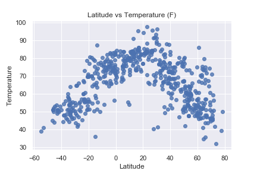
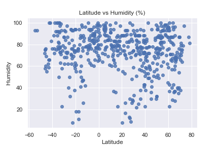
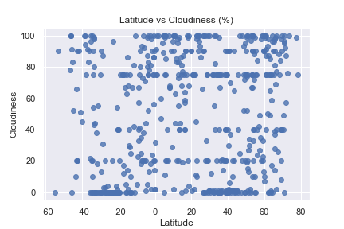

# JSON_WeatherPy

## Analysis

* As expected, there was a clear correlation between the closeness of the Equator and the measured Temperature. However, the Temperature showed its peak not precisely at over the Equator, but 20 degrees north of it. 

* Humidity showed little correlation with latitude, with a marked exception of the Equator and its proximities. Latitude cero exhibited the highest humidity concentration of all the distribution. 

* Cloudiness and Wind Speed showed no clear relationship with Latitude.

## Background 

Python script to visualize the weather of 500+ cities across the world of varying distance from the equator using [CityPy](https://pypi.python.org/pypi/citipy), a simple Python library, and the [OpenWeatherMap](https://openweathermap.org/api) API. 

The visualizations includce a series of scatter plots to showcase the following relationships:

    Temperature (F) vs. Latitude
    Humidity (%) vs. Latitude
    Cloudiness (%) vs. Latitude
    Wind Speed (mph) vs. Latitude

The script accomplishes the following: 

* Randomly selects at least 500 unique (non-repeat) cities based on latitude and longitude.

* Performs a weather check on each of the cities using a series of successive API calls.

* Includes a print log of each city as it's being processed with the city number and city name.

* Saves both a CSV of all data retrieved and png images for each scatter plot.


```python
# Dependencies and Setup
import seaborn as sns
import pandas as pd
import numpy as np
import requests
import time

# Import API key
from api_keys import api_key

# Incorporated citipy to determine city based on latitude and longitude
from citipy import citipy

# Range of latitudes and longitudes
lat_range = (-90, 90)
lng_range = (-180, 180)
```
## Generate Cities List


```python
# List for holding lat_lngs and cities
lat_lngs = []
cities = []

# Create a set of random lat and lng combinations
lats = np.random.uniform(low=-90.000, high=90.000, size=1500)
lngs = np.random.uniform(low=-180.000, high=180.000, size=1500)
lat_lngs = zip(lats, lngs)

# Identify nearest city for each lat, lng combination
for lat_lng in lat_lngs:
    city = citipy.nearest_city(lat_lng[0], lat_lng[1]).city_name
    
    # If the city is unique, then add it to a our cities list
    if city not in cities:
        cities.append(city)

# Print the city count to confirm sufficient count
len(cities)
```
615

## Perform API Calls

```python
# Perform API Calls
url = "http://api.openweathermap.org/data/2.5/weather?units=Imperial&APPID=" + api_key 

temperature_list = []
humidity_list = []
cloudiness_list = []
wind_speed_list = []
latitude_list = []
counter = 1

for city in cities:
    try:
        query_url = f"{url}&q={city}"
        weather_response = requests.get(query_url).json()
        
        counter += 1
        print(f"Processing Record {counter} | {city}")
        print(f"{url}&q={city}")

        temperature = weather_response["main"]["temp"]
        temperature_list.append(temperature)
    
        humidity = weather_response["main"]["humidity"]
        humidity_list.append(humidity)
    
        cloudiness = weather_response["clouds"]["all"]
        cloudiness_list.append(cloudiness)
    
        wind_speed = weather_response["wind"]["speed"]
        wind_speed_list.append(wind_speed)
    
        latitude = weather_response["coord"]["lat"]
        latitude_list.append(latitude)
        
    except:
        print("City not found. Skipping...")
    
print("Data Retrieval Complete")
```

Processing Record 2 | taolanaro
http://api.openweathermap.org/data/2.5/weather?units=Imperial&APPID=0ee92ce27ddbdf29cf7f08a5b20c016f&q=taolanaro
City not found. Skipping...
Processing Record 3 | petropavlovsk-kamchatskiy
http://api.openweathermap.org/data/2.5/weather?units=Imperial&APPID=0ee92ce27ddbdf29cf7f08a5b20c016f&q=petropavlovsk-kamchatskiy
Processing Record 4 | barentsburg
http://api.openweathermap.org/data/2.5/weather?units=Imperial&APPID=0ee92ce27ddbdf29cf7f08a5b20c016f&q=barentsburg
City not found. Skipping...
Processing Record 5 | salalah
http://api.openweathermap.org/data/2.5/weather?units=Imperial&APPID=0ee92ce27ddbdf29cf7f08a5b20c016f&q=salalah
Processing Record 6 | shenkursk
http://api.openweathermap.org/data/2.5/weather?units=Imperial&APPID=0ee92ce27ddbdf29cf7f08a5b20c016f&q=shenkursk
Processing Record 7 | klaksvik
http://api.openweathermap.org/data/2.5/weather?units=Imperial&APPID=0ee92ce27ddbdf29cf7f08a5b20c016f&q=klaksvik
Processing Record 8 | ekhabi
http://api.openweathermap.org/data/2.5/weather?units=Imperial&APPID=0ee92ce27ddbdf29cf7f08a5b20c016f&q=ekhabi
Processing Record 9 | lebu
http://api.openweathermap.org/data/2.5/weather?units=Imperial&APPID=0ee92ce27ddbdf29cf7f08a5b20c016f&q=lebu
Processing Record 10 | kruisfontein
http://api.openweathermap.org/data/2.5/weather?units=Imperial&APPID=0ee92ce27ddbdf29cf7f08a5b20c016f&q=kruisfontein
Processing Record 11 | rikitea
http://api.openweathermap.org/data/2.5/weather?units=Imperial&APPID=0ee92ce27ddbdf29cf7f08a5b20c016f&q=rikitea
Processing Record 12 | saint george
http://api.openweathermap.org/data/2.5/weather?units=Imperial&APPID=0ee92ce27ddbdf29cf7f08a5b20c016f&q=saint george
Processing Record 13 | mataura
http://api.openweathermap.org/data/2.5/weather?units=Imperial&APPID=0ee92ce27ddbdf29cf7f08a5b20c016f&q=mataura
Processing Record 14 | airai
http://api.openweathermap.org/data/2.5/weather?units=Imperial&APPID=0ee92ce27ddbdf29cf7f08a5b20c016f&q=airai
Processing Record 15 | bluff
http://api.openweathermap.org/data/2.5/weather?units=Imperial&APPID=0ee92ce27ddbdf29cf7f08a5b20c016f&q=bluff
Processing Record 16 | labuhan
http://api.openweathermap.org/data/2.5/weather?units=Imperial&APPID=0ee92ce27ddbdf29cf7f08a5b20c016f&q=labuhan
Processing Record 17 | brewster
http://api.openweathermap.org/data/2.5/weather?units=Imperial&APPID=0ee92ce27ddbdf29cf7f08a5b20c016f&q=brewster
Processing Record 18 | waingapu
http://api.openweathermap.org/data/2.5/weather?units=Imperial&APPID=0ee92ce27ddbdf29cf7f08a5b20c016f&q=waingapu
Processing Record 19 | punta arenas
http://api.openweathermap.org/data/2.5/weather?units=Imperial&APPID=0ee92ce27ddbdf29cf7f08a5b20c016f&q=punta arenas
Processing Record 20 | jamestown
http://api.openweathermap.org/data/2.5/weather?units=Imperial&APPID=0ee92ce27ddbdf29cf7f08a5b20c016f&q=jamestown
Processing Record 21 | atuona
http://api.openweathermap.org/data/2.5/weather?units=Imperial&APPID=0ee92ce27ddbdf29cf7f08a5b20c016f&q=atuona
Processing Record 22 | ushuaia
http://api.openweathermap.org/data/2.5/weather?units=Imperial&APPID=0ee92ce27ddbdf29cf7f08a5b20c016f&q=ushuaia
Processing Record 23 | hilo
http://api.openweathermap.org/data/2.5/weather?units=Imperial&APPID=0ee92ce27ddbdf29cf7f08a5b20c016f&q=hilo
Processing Record 24 | butaritari
http://api.openweathermap.org/data/2.5/weather?units=Imperial&APPID=0ee92ce27ddbdf29cf7f08a5b20c016f&q=butaritari
Processing Record 25 | boende
http://api.openweathermap.org/data/2.5/weather?units=Imperial&APPID=0ee92ce27ddbdf29cf7f08a5b20c016f&q=boende
Processing Record 26 | vostok
http://api.openweathermap.org/data/2.5/weather?units=Imperial&APPID=0ee92ce27ddbdf29cf7f08a5b20c016f&q=vostok
Processing Record 27 | qaanaaq
http://api.openweathermap.org/data/2.5/weather?units=Imperial&APPID=0ee92ce27ddbdf29cf7f08a5b20c016f&q=qaanaaq
Processing Record 28 | krasnogorskoye
http://api.openweathermap.org/data/2.5/weather?units=Imperial&APPID=0ee92ce27ddbdf29cf7f08a5b20c016f&q=krasnogorskoye
Processing Record 29 | roma
http://api.openweathermap.org/data/2.5/weather?units=Imperial&APPID=0ee92ce27ddbdf29cf7f08a5b20c016f&q=roma
Processing Record 30 | prainha
http://api.openweathermap.org/data/2.5/weather?units=Imperial&APPID=0ee92ce27ddbdf29cf7f08a5b20c016f&q=prainha
Processing Record 31 | zyryanka
http://api.openweathermap.org/data/2.5/weather?units=Imperial&APPID=0ee92ce27ddbdf29cf7f08a5b20c016f&q=zyryanka
Processing Record 32 | cockburn town
http://api.openweathermap.org/data/2.5/weather?units=Imperial&APPID=0ee92ce27ddbdf29cf7f08a5b20c016f&q=cockburn town
Processing Record 33 | new norfolk
http://api.openweathermap.org/data/2.5/weather?units=Imperial&APPID=0ee92ce27ddbdf29cf7f08a5b20c016f&q=new norfolk
Processing Record 34 | thompson
http://api.openweathermap.org/data/2.5/weather?units=Imperial&APPID=0ee92ce27ddbdf29cf7f08a5b20c016f&q=thompson
Processing Record 35 | buchanan
http://api.openweathermap.org/data/2.5/weather?units=Imperial&APPID=0ee92ce27ddbdf29cf7f08a5b20c016f&q=buchanan
Processing Record 36 | turukhansk
http://api.openweathermap.org/data/2.5/weather?units=Imperial&APPID=0ee92ce27ddbdf29cf7f08a5b20c016f&q=turukhansk
Processing Record 37 | la ronge
http://api.openweathermap.org/data/2.5/weather?units=Imperial&APPID=0ee92ce27ddbdf29cf7f08a5b20c016f&q=la ronge
Processing Record 38 | arraial do cabo
http://api.openweathermap.org/data/2.5/weather?units=Imperial&APPID=0ee92ce27ddbdf29cf7f08a5b20c016f&q=arraial do cabo
Processing Record 39 | eureka
http://api.openweathermap.org/data/2.5/weather?units=Imperial&APPID=0ee92ce27ddbdf29cf7f08a5b20c016f&q=eureka
Processing Record 40 | avarua
http://api.openweathermap.org/data/2.5/weather?units=Imperial&APPID=0ee92ce27ddbdf29cf7f08a5b20c016f&q=avarua
Processing Record 41 | illoqqortoormiut
http://api.openweathermap.org/data/2.5/weather?units=Imperial&APPID=0ee92ce27ddbdf29cf7f08a5b20c016f&q=illoqqortoormiut
City not found. Skipping...
Processing Record 42 | corralillo
http://api.openweathermap.org/data/2.5/weather?units=Imperial&APPID=0ee92ce27ddbdf29cf7f08a5b20c016f&q=corralillo
Processing Record 43 | constitucion
http://api.openweathermap.org/data/2.5/weather?units=Imperial&APPID=0ee92ce27ddbdf29cf7f08a5b20c016f&q=constitucion
Processing Record 44 | busselton
http://api.openweathermap.org/data/2.5/weather?units=Imperial&APPID=0ee92ce27ddbdf29cf7f08a5b20c016f&q=busselton
Processing Record 45 | orcopampa
http://api.openweathermap.org/data/2.5/weather?units=Imperial&APPID=0ee92ce27ddbdf29cf7f08a5b20c016f&q=orcopampa
Processing Record 46 | lompoc
http://api.openweathermap.org/data/2.5/weather?units=Imperial&APPID=0ee92ce27ddbdf29cf7f08a5b20c016f&q=lompoc
Processing Record 47 | bambous virieux
http://api.openweathermap.org/data/2.5/weather?units=Imperial&APPID=0ee92ce27ddbdf29cf7f08a5b20c016f&q=bambous virieux
Processing Record 48 | sabha
http://api.openweathermap.org/data/2.5/weather?units=Imperial&APPID=0ee92ce27ddbdf29cf7f08a5b20c016f&q=sabha
Processing Record 49 | lufilufi
http://api.openweathermap.org/data/2.5/weather?units=Imperial&APPID=0ee92ce27ddbdf29cf7f08a5b20c016f&q=lufilufi
Processing Record 50 | minggang
http://api.openweathermap.org/data/2.5/weather?units=Imperial&APPID=0ee92ce27ddbdf29cf7f08a5b20c016f&q=minggang
Processing Record 51 | rawson
http://api.openweathermap.org/data/2.5/weather?units=Imperial&APPID=0ee92ce27ddbdf29cf7f08a5b20c016f&q=rawson
Processing Record 52 | east london
http://api.openweathermap.org/data/2.5/weather?units=Imperial&APPID=0ee92ce27ddbdf29cf7f08a5b20c016f&q=east london
Processing Record 53 | ketchikan
http://api.openweathermap.org/data/2.5/weather?units=Imperial&APPID=0ee92ce27ddbdf29cf7f08a5b20c016f&q=ketchikan
Processing Record 54 | smidovich
http://api.openweathermap.org/data/2.5/weather?units=Imperial&APPID=0ee92ce27ddbdf29cf7f08a5b20c016f&q=smidovich
Processing Record 55 | dafeng
http://api.openweathermap.org/data/2.5/weather?units=Imperial&APPID=0ee92ce27ddbdf29cf7f08a5b20c016f&q=dafeng
Processing Record 56 | nizhneyansk
http://api.openweathermap.org/data/2.5/weather?units=Imperial&APPID=0ee92ce27ddbdf29cf7f08a5b20c016f&q=nizhneyansk
City not found. Skipping...
Processing Record 57 | hermanus
http://api.openweathermap.org/data/2.5/weather?units=Imperial&APPID=0ee92ce27ddbdf29cf7f08a5b20c016f&q=hermanus
Processing Record 58 | barentu
http://api.openweathermap.org/data/2.5/weather?units=Imperial&APPID=0ee92ce27ddbdf29cf7f08a5b20c016f&q=barentu
Processing Record 59 | ngukurr
http://api.openweathermap.org/data/2.5/weather?units=Imperial&APPID=0ee92ce27ddbdf29cf7f08a5b20c016f&q=ngukurr
City not found. Skipping...
Processing Record 60 | vaini
http://api.openweathermap.org/data/2.5/weather?units=Imperial&APPID=0ee92ce27ddbdf29cf7f08a5b20c016f&q=vaini
Processing Record 61 | iskilip
http://api.openweathermap.org/data/2.5/weather?units=Imperial&APPID=0ee92ce27ddbdf29cf7f08a5b20c016f&q=iskilip
Processing Record 62 | palpa
http://api.openweathermap.org/data/2.5/weather?units=Imperial&APPID=0ee92ce27ddbdf29cf7f08a5b20c016f&q=palpa
Processing Record 63 | dingle
http://api.openweathermap.org/data/2.5/weather?units=Imperial&APPID=0ee92ce27ddbdf29cf7f08a5b20c016f&q=dingle
Processing Record 64 | qui nhon
http://api.openweathermap.org/data/2.5/weather?units=Imperial&APPID=0ee92ce27ddbdf29cf7f08a5b20c016f&q=qui nhon
City not found. Skipping...
Processing Record 65 | paamiut
http://api.openweathermap.org/data/2.5/weather?units=Imperial&APPID=0ee92ce27ddbdf29cf7f08a5b20c016f&q=paamiut
Processing Record 66 | hobart
http://api.openweathermap.org/data/2.5/weather?units=Imperial&APPID=0ee92ce27ddbdf29cf7f08a5b20c016f&q=hobart
Processing Record 67 | barrow
http://api.openweathermap.org/data/2.5/weather?units=Imperial&APPID=0ee92ce27ddbdf29cf7f08a5b20c016f&q=barrow
Processing Record 68 | krasnoselkup
http://api.openweathermap.org/data/2.5/weather?units=Imperial&APPID=0ee92ce27ddbdf29cf7f08a5b20c016f&q=krasnoselkup
City not found. Skipping...
Processing Record 69 | karpogory
http://api.openweathermap.org/data/2.5/weather?units=Imperial&APPID=0ee92ce27ddbdf29cf7f08a5b20c016f&q=karpogory
Processing Record 70 | tevriz
http://api.openweathermap.org/data/2.5/weather?units=Imperial&APPID=0ee92ce27ddbdf29cf7f08a5b20c016f&q=tevriz
Processing Record 71 | cheuskiny
http://api.openweathermap.org/data/2.5/weather?units=Imperial&APPID=0ee92ce27ddbdf29cf7f08a5b20c016f&q=cheuskiny
City not found. Skipping...
Processing Record 72 | victoria
http://api.openweathermap.org/data/2.5/weather?units=Imperial&APPID=0ee92ce27ddbdf29cf7f08a5b20c016f&q=victoria
Processing Record 73 | maraa
http://api.openweathermap.org/data/2.5/weather?units=Imperial&APPID=0ee92ce27ddbdf29cf7f08a5b20c016f&q=maraa
Processing Record 74 | maxixe
http://api.openweathermap.org/data/2.5/weather?units=Imperial&APPID=0ee92ce27ddbdf29cf7f08a5b20c016f&q=maxixe
Processing Record 75 | castro
http://api.openweathermap.org/data/2.5/weather?units=Imperial&APPID=0ee92ce27ddbdf29cf7f08a5b20c016f&q=castro
Processing Record 76 | pombas
http://api.openweathermap.org/data/2.5/weather?units=Imperial&APPID=0ee92ce27ddbdf29cf7f08a5b20c016f&q=pombas
Processing Record 77 | marcona
http://api.openweathermap.org/data/2.5/weather?units=Imperial&APPID=0ee92ce27ddbdf29cf7f08a5b20c016f&q=marcona
City not found. Skipping...
Processing Record 78 | alaca
http://api.openweathermap.org/data/2.5/weather?units=Imperial&APPID=0ee92ce27ddbdf29cf7f08a5b20c016f&q=alaca
Processing Record 79 | azimur
http://api.openweathermap.org/data/2.5/weather?units=Imperial&APPID=0ee92ce27ddbdf29cf7f08a5b20c016f&q=azimur
City not found. Skipping...
Processing Record 80 | gwadar
http://api.openweathermap.org/data/2.5/weather?units=Imperial&APPID=0ee92ce27ddbdf29cf7f08a5b20c016f&q=gwadar
Processing Record 81 | totness
http://api.openweathermap.org/data/2.5/weather?units=Imperial&APPID=0ee92ce27ddbdf29cf7f08a5b20c016f&q=totness
Processing Record 82 | talnakh
http://api.openweathermap.org/data/2.5/weather?units=Imperial&APPID=0ee92ce27ddbdf29cf7f08a5b20c016f&q=talnakh
Processing Record 83 | puerto ayora
http://api.openweathermap.org/data/2.5/weather?units=Imperial&APPID=0ee92ce27ddbdf29cf7f08a5b20c016f&q=puerto ayora
Processing Record 84 | upernavik
http://api.openweathermap.org/data/2.5/weather?units=Imperial&APPID=0ee92ce27ddbdf29cf7f08a5b20c016f&q=upernavik
Processing Record 85 | samusu
http://api.openweathermap.org/data/2.5/weather?units=Imperial&APPID=0ee92ce27ddbdf29cf7f08a5b20c016f&q=samusu
City not found. Skipping...
Processing Record 86 | kapaa
http://api.openweathermap.org/data/2.5/weather?units=Imperial&APPID=0ee92ce27ddbdf29cf7f08a5b20c016f&q=kapaa
Processing Record 87 | saskylakh
http://api.openweathermap.org/data/2.5/weather?units=Imperial&APPID=0ee92ce27ddbdf29cf7f08a5b20c016f&q=saskylakh
Processing Record 88 | mar del plata
http://api.openweathermap.org/data/2.5/weather?units=Imperial&APPID=0ee92ce27ddbdf29cf7f08a5b20c016f&q=mar del plata
Processing Record 89 | tiksi
http://api.openweathermap.org/data/2.5/weather?units=Imperial&APPID=0ee92ce27ddbdf29cf7f08a5b20c016f&q=tiksi
Processing Record 90 | port alfred
http://api.openweathermap.org/data/2.5/weather?units=Imperial&APPID=0ee92ce27ddbdf29cf7f08a5b20c016f&q=port alfred
Processing Record 91 | pisco
http://api.openweathermap.org/data/2.5/weather?units=Imperial&APPID=0ee92ce27ddbdf29cf7f08a5b20c016f&q=pisco
Processing Record 92 | turtas
http://api.openweathermap.org/data/2.5/weather?units=Imperial&APPID=0ee92ce27ddbdf29cf7f08a5b20c016f&q=turtas
Processing Record 93 | padang
http://api.openweathermap.org/data/2.5/weather?units=Imperial&APPID=0ee92ce27ddbdf29cf7f08a5b20c016f&q=padang
Processing Record 94 | albany
http://api.openweathermap.org/data/2.5/weather?units=Imperial&APPID=0ee92ce27ddbdf29cf7f08a5b20c016f&q=albany
Processing Record 95 | torbay
http://api.openweathermap.org/data/2.5/weather?units=Imperial&APPID=0ee92ce27ddbdf29cf7f08a5b20c016f&q=torbay
Processing Record 96 | saint-philippe
http://api.openweathermap.org/data/2.5/weather?units=Imperial&APPID=0ee92ce27ddbdf29cf7f08a5b20c016f&q=saint-philippe
Processing Record 97 | narsaq
http://api.openweathermap.org/data/2.5/weather?units=Imperial&APPID=0ee92ce27ddbdf29cf7f08a5b20c016f&q=narsaq
Processing Record 98 | faanui
http://api.openweathermap.org/data/2.5/weather?units=Imperial&APPID=0ee92ce27ddbdf29cf7f08a5b20c016f&q=faanui
Processing Record 99 | kununurra
http://api.openweathermap.org/data/2.5/weather?units=Imperial&APPID=0ee92ce27ddbdf29cf7f08a5b20c016f&q=kununurra
Processing Record 100 | dikson
http://api.openweathermap.org/data/2.5/weather?units=Imperial&APPID=0ee92ce27ddbdf29cf7f08a5b20c016f&q=dikson
Processing Record 101 | norman wells
http://api.openweathermap.org/data/2.5/weather?units=Imperial&APPID=0ee92ce27ddbdf29cf7f08a5b20c016f&q=norman wells
Processing Record 102 | severo-kurilsk
http://api.openweathermap.org/data/2.5/weather?units=Imperial&APPID=0ee92ce27ddbdf29cf7f08a5b20c016f&q=severo-kurilsk
Processing Record 103 | georgetown
http://api.openweathermap.org/data/2.5/weather?units=Imperial&APPID=0ee92ce27ddbdf29cf7f08a5b20c016f&q=georgetown
Processing Record 104 | attawapiskat
http://api.openweathermap.org/data/2.5/weather?units=Imperial&APPID=0ee92ce27ddbdf29cf7f08a5b20c016f&q=attawapiskat
City not found. Skipping...
Processing Record 105 | aklavik
http://api.openweathermap.org/data/2.5/weather?units=Imperial&APPID=0ee92ce27ddbdf29cf7f08a5b20c016f&q=aklavik
Processing Record 106 | cape town
http://api.openweathermap.org/data/2.5/weather?units=Imperial&APPID=0ee92ce27ddbdf29cf7f08a5b20c016f&q=cape town
Processing Record 107 | hithadhoo
http://api.openweathermap.org/data/2.5/weather?units=Imperial&APPID=0ee92ce27ddbdf29cf7f08a5b20c016f&q=hithadhoo
Processing Record 108 | bethel
http://api.openweathermap.org/data/2.5/weather?units=Imperial&APPID=0ee92ce27ddbdf29cf7f08a5b20c016f&q=bethel
Processing Record 109 | nemuro
http://api.openweathermap.org/data/2.5/weather?units=Imperial&APPID=0ee92ce27ddbdf29cf7f08a5b20c016f&q=nemuro
Processing Record 110 | umzimvubu
http://api.openweathermap.org/data/2.5/weather?units=Imperial&APPID=0ee92ce27ddbdf29cf7f08a5b20c016f&q=umzimvubu
City not found. Skipping...
Processing Record 111 | san quintin
http://api.openweathermap.org/data/2.5/weather?units=Imperial&APPID=0ee92ce27ddbdf29cf7f08a5b20c016f&q=san quintin
Processing Record 112 | jieshi
http://api.openweathermap.org/data/2.5/weather?units=Imperial&APPID=0ee92ce27ddbdf29cf7f08a5b20c016f&q=jieshi
Processing Record 113 | malakal
http://api.openweathermap.org/data/2.5/weather?units=Imperial&APPID=0ee92ce27ddbdf29cf7f08a5b20c016f&q=malakal
City not found. Skipping...
Processing Record 114 | mayo
http://api.openweathermap.org/data/2.5/weather?units=Imperial&APPID=0ee92ce27ddbdf29cf7f08a5b20c016f&q=mayo
Processing Record 115 | mount gambier
http://api.openweathermap.org/data/2.5/weather?units=Imperial&APPID=0ee92ce27ddbdf29cf7f08a5b20c016f&q=mount gambier
Processing Record 116 | sampit
http://api.openweathermap.org/data/2.5/weather?units=Imperial&APPID=0ee92ce27ddbdf29cf7f08a5b20c016f&q=sampit
Processing Record 117 | leningradskiy
http://api.openweathermap.org/data/2.5/weather?units=Imperial&APPID=0ee92ce27ddbdf29cf7f08a5b20c016f&q=leningradskiy
Processing Record 118 | port lincoln
http://api.openweathermap.org/data/2.5/weather?units=Imperial&APPID=0ee92ce27ddbdf29cf7f08a5b20c016f&q=port lincoln
Processing Record 119 | belushya guba
http://api.openweathermap.org/data/2.5/weather?units=Imperial&APPID=0ee92ce27ddbdf29cf7f08a5b20c016f&q=belushya guba
City not found. Skipping...
Processing Record 120 | danielskuil
http://api.openweathermap.org/data/2.5/weather?units=Imperial&APPID=0ee92ce27ddbdf29cf7f08a5b20c016f&q=danielskuil
Processing Record 121 | zharkent
http://api.openweathermap.org/data/2.5/weather?units=Imperial&APPID=0ee92ce27ddbdf29cf7f08a5b20c016f&q=zharkent
Processing Record 122 | looc
http://api.openweathermap.org/data/2.5/weather?units=Imperial&APPID=0ee92ce27ddbdf29cf7f08a5b20c016f&q=looc
Processing Record 123 | bredasdorp
http://api.openweathermap.org/data/2.5/weather?units=Imperial&APPID=0ee92ce27ddbdf29cf7f08a5b20c016f&q=bredasdorp
Processing Record 124 | calama
http://api.openweathermap.org/data/2.5/weather?units=Imperial&APPID=0ee92ce27ddbdf29cf7f08a5b20c016f&q=calama
Processing Record 125 | provideniya
http://api.openweathermap.org/data/2.5/weather?units=Imperial&APPID=0ee92ce27ddbdf29cf7f08a5b20c016f&q=provideniya
Processing Record 126 | souillac
http://api.openweathermap.org/data/2.5/weather?units=Imperial&APPID=0ee92ce27ddbdf29cf7f08a5b20c016f&q=souillac
Processing Record 127 | ponta do sol
http://api.openweathermap.org/data/2.5/weather?units=Imperial&APPID=0ee92ce27ddbdf29cf7f08a5b20c016f&q=ponta do sol
Processing Record 128 | san cristobal
http://api.openweathermap.org/data/2.5/weather?units=Imperial&APPID=0ee92ce27ddbdf29cf7f08a5b20c016f&q=san cristobal
Processing Record 129 | kavaratti
http://api.openweathermap.org/data/2.5/weather?units=Imperial&APPID=0ee92ce27ddbdf29cf7f08a5b20c016f&q=kavaratti
Processing Record 130 | awbari
http://api.openweathermap.org/data/2.5/weather?units=Imperial&APPID=0ee92ce27ddbdf29cf7f08a5b20c016f&q=awbari
Processing Record 131 | saumur
http://api.openweathermap.org/data/2.5/weather?units=Imperial&APPID=0ee92ce27ddbdf29cf7f08a5b20c016f&q=saumur
Processing Record 132 | katsuura
http://api.openweathermap.org/data/2.5/weather?units=Imperial&APPID=0ee92ce27ddbdf29cf7f08a5b20c016f&q=katsuura
Processing Record 133 | havoysund
http://api.openweathermap.org/data/2.5/weather?units=Imperial&APPID=0ee92ce27ddbdf29cf7f08a5b20c016f&q=havoysund
Processing Record 134 | geraldton
http://api.openweathermap.org/data/2.5/weather?units=Imperial&APPID=0ee92ce27ddbdf29cf7f08a5b20c016f&q=geraldton
Processing Record 135 | dombarovskiy
http://api.openweathermap.org/data/2.5/weather?units=Imperial&APPID=0ee92ce27ddbdf29cf7f08a5b20c016f&q=dombarovskiy
Processing Record 136 | birobidzhan
http://api.openweathermap.org/data/2.5/weather?units=Imperial&APPID=0ee92ce27ddbdf29cf7f08a5b20c016f&q=birobidzhan
Processing Record 137 | kodiak
http://api.openweathermap.org/data/2.5/weather?units=Imperial&APPID=0ee92ce27ddbdf29cf7f08a5b20c016f&q=kodiak
Processing Record 138 | bentiu
http://api.openweathermap.org/data/2.5/weather?units=Imperial&APPID=0ee92ce27ddbdf29cf7f08a5b20c016f&q=bentiu
City not found. Skipping...
Processing Record 139 | sitka
http://api.openweathermap.org/data/2.5/weather?units=Imperial&APPID=0ee92ce27ddbdf29cf7f08a5b20c016f&q=sitka
Processing Record 140 | chernyshevskiy
http://api.openweathermap.org/data/2.5/weather?units=Imperial&APPID=0ee92ce27ddbdf29cf7f08a5b20c016f&q=chernyshevskiy
Processing Record 141 | thinadhoo
http://api.openweathermap.org/data/2.5/weather?units=Imperial&APPID=0ee92ce27ddbdf29cf7f08a5b20c016f&q=thinadhoo
Processing Record 142 | luganville
http://api.openweathermap.org/data/2.5/weather?units=Imperial&APPID=0ee92ce27ddbdf29cf7f08a5b20c016f&q=luganville
Processing Record 143 | bazarnyye mataki
http://api.openweathermap.org/data/2.5/weather?units=Imperial&APPID=0ee92ce27ddbdf29cf7f08a5b20c016f&q=bazarnyye mataki
Processing Record 144 | zhongshu
http://api.openweathermap.org/data/2.5/weather?units=Imperial&APPID=0ee92ce27ddbdf29cf7f08a5b20c016f&q=zhongshu
Processing Record 145 | tuatapere
http://api.openweathermap.org/data/2.5/weather?units=Imperial&APPID=0ee92ce27ddbdf29cf7f08a5b20c016f&q=tuatapere
Processing Record 146 | abu zabad
http://api.openweathermap.org/data/2.5/weather?units=Imperial&APPID=0ee92ce27ddbdf29cf7f08a5b20c016f&q=abu zabad
Processing Record 147 | yar-sale
http://api.openweathermap.org/data/2.5/weather?units=Imperial&APPID=0ee92ce27ddbdf29cf7f08a5b20c016f&q=yar-sale
Processing Record 148 | bandarbeyla
http://api.openweathermap.org/data/2.5/weather?units=Imperial&APPID=0ee92ce27ddbdf29cf7f08a5b20c016f&q=bandarbeyla
Processing Record 149 | chokurdakh
http://api.openweathermap.org/data/2.5/weather?units=Imperial&APPID=0ee92ce27ddbdf29cf7f08a5b20c016f&q=chokurdakh
Processing Record 150 | rocha
http://api.openweathermap.org/data/2.5/weather?units=Imperial&APPID=0ee92ce27ddbdf29cf7f08a5b20c016f&q=rocha
Processing Record 151 | nyurba
http://api.openweathermap.org/data/2.5/weather?units=Imperial&APPID=0ee92ce27ddbdf29cf7f08a5b20c016f&q=nyurba
Processing Record 152 | itaituba
http://api.openweathermap.org/data/2.5/weather?units=Imperial&APPID=0ee92ce27ddbdf29cf7f08a5b20c016f&q=itaituba
Processing Record 153 | janesville
http://api.openweathermap.org/data/2.5/weather?units=Imperial&APPID=0ee92ce27ddbdf29cf7f08a5b20c016f&q=janesville
Processing Record 154 | panlaitan
http://api.openweathermap.org/data/2.5/weather?units=Imperial&APPID=0ee92ce27ddbdf29cf7f08a5b20c016f&q=panlaitan
Processing Record 155 | kharp
http://api.openweathermap.org/data/2.5/weather?units=Imperial&APPID=0ee92ce27ddbdf29cf7f08a5b20c016f&q=kharp
Processing Record 156 | dujuma
http://api.openweathermap.org/data/2.5/weather?units=Imperial&APPID=0ee92ce27ddbdf29cf7f08a5b20c016f&q=dujuma
City not found. Skipping...
Processing Record 157 | carnarvon
http://api.openweathermap.org/data/2.5/weather?units=Imperial&APPID=0ee92ce27ddbdf29cf7f08a5b20c016f&q=carnarvon
Processing Record 158 | kawalu
http://api.openweathermap.org/data/2.5/weather?units=Imperial&APPID=0ee92ce27ddbdf29cf7f08a5b20c016f&q=kawalu
Processing Record 159 | mastic beach
http://api.openweathermap.org/data/2.5/weather?units=Imperial&APPID=0ee92ce27ddbdf29cf7f08a5b20c016f&q=mastic beach
Processing Record 160 | yamada
http://api.openweathermap.org/data/2.5/weather?units=Imperial&APPID=0ee92ce27ddbdf29cf7f08a5b20c016f&q=yamada
Processing Record 161 | komsomolskiy
http://api.openweathermap.org/data/2.5/weather?units=Imperial&APPID=0ee92ce27ddbdf29cf7f08a5b20c016f&q=komsomolskiy
Processing Record 162 | kaitangata
http://api.openweathermap.org/data/2.5/weather?units=Imperial&APPID=0ee92ce27ddbdf29cf7f08a5b20c016f&q=kaitangata
Processing Record 163 | peachland
http://api.openweathermap.org/data/2.5/weather?units=Imperial&APPID=0ee92ce27ddbdf29cf7f08a5b20c016f&q=peachland
Processing Record 164 | keita
http://api.openweathermap.org/data/2.5/weather?units=Imperial&APPID=0ee92ce27ddbdf29cf7f08a5b20c016f&q=keita
Processing Record 165 | sinazongwe
http://api.openweathermap.org/data/2.5/weather?units=Imperial&APPID=0ee92ce27ddbdf29cf7f08a5b20c016f&q=sinazongwe
Processing Record 166 | mumford
http://api.openweathermap.org/data/2.5/weather?units=Imperial&APPID=0ee92ce27ddbdf29cf7f08a5b20c016f&q=mumford
Processing Record 167 | ilulissat
http://api.openweathermap.org/data/2.5/weather?units=Imperial&APPID=0ee92ce27ddbdf29cf7f08a5b20c016f&q=ilulissat
Processing Record 168 | samarai
http://api.openweathermap.org/data/2.5/weather?units=Imperial&APPID=0ee92ce27ddbdf29cf7f08a5b20c016f&q=samarai
Processing Record 169 | lago da pedra
http://api.openweathermap.org/data/2.5/weather?units=Imperial&APPID=0ee92ce27ddbdf29cf7f08a5b20c016f&q=lago da pedra
City not found. Skipping...
Processing Record 170 | bonthe
http://api.openweathermap.org/data/2.5/weather?units=Imperial&APPID=0ee92ce27ddbdf29cf7f08a5b20c016f&q=bonthe
Processing Record 171 | hofn
http://api.openweathermap.org/data/2.5/weather?units=Imperial&APPID=0ee92ce27ddbdf29cf7f08a5b20c016f&q=hofn
Processing Record 172 | mahina
http://api.openweathermap.org/data/2.5/weather?units=Imperial&APPID=0ee92ce27ddbdf29cf7f08a5b20c016f&q=mahina
Processing Record 173 | cabo san lucas
http://api.openweathermap.org/data/2.5/weather?units=Imperial&APPID=0ee92ce27ddbdf29cf7f08a5b20c016f&q=cabo san lucas
Processing Record 174 | ayan
http://api.openweathermap.org/data/2.5/weather?units=Imperial&APPID=0ee92ce27ddbdf29cf7f08a5b20c016f&q=ayan
Processing Record 175 | derzhavinsk
http://api.openweathermap.org/data/2.5/weather?units=Imperial&APPID=0ee92ce27ddbdf29cf7f08a5b20c016f&q=derzhavinsk
Processing Record 176 | anta
http://api.openweathermap.org/data/2.5/weather?units=Imperial&APPID=0ee92ce27ddbdf29cf7f08a5b20c016f&q=anta
Processing Record 177 | laguna
http://api.openweathermap.org/data/2.5/weather?units=Imperial&APPID=0ee92ce27ddbdf29cf7f08a5b20c016f&q=laguna
Processing Record 178 | manokwari
http://api.openweathermap.org/data/2.5/weather?units=Imperial&APPID=0ee92ce27ddbdf29cf7f08a5b20c016f&q=manokwari
Processing Record 179 | timizart
http://api.openweathermap.org/data/2.5/weather?units=Imperial&APPID=0ee92ce27ddbdf29cf7f08a5b20c016f&q=timizart
Processing Record 180 | belmonte
http://api.openweathermap.org/data/2.5/weather?units=Imperial&APPID=0ee92ce27ddbdf29cf7f08a5b20c016f&q=belmonte
Processing Record 181 | kizner
http://api.openweathermap.org/data/2.5/weather?units=Imperial&APPID=0ee92ce27ddbdf29cf7f08a5b20c016f&q=kizner
Processing Record 182 | tsihombe
http://api.openweathermap.org/data/2.5/weather?units=Imperial&APPID=0ee92ce27ddbdf29cf7f08a5b20c016f&q=tsihombe
City not found. Skipping...
Processing Record 183 | ningan
http://api.openweathermap.org/data/2.5/weather?units=Imperial&APPID=0ee92ce27ddbdf29cf7f08a5b20c016f&q=ningan
City not found. Skipping...
Processing Record 184 | port-gentil
http://api.openweathermap.org/data/2.5/weather?units=Imperial&APPID=0ee92ce27ddbdf29cf7f08a5b20c016f&q=port-gentil
Processing Record 185 | lata
http://api.openweathermap.org/data/2.5/weather?units=Imperial&APPID=0ee92ce27ddbdf29cf7f08a5b20c016f&q=lata
Processing Record 186 | mahajanga
http://api.openweathermap.org/data/2.5/weather?units=Imperial&APPID=0ee92ce27ddbdf29cf7f08a5b20c016f&q=mahajanga
Processing Record 187 | cairns
http://api.openweathermap.org/data/2.5/weather?units=Imperial&APPID=0ee92ce27ddbdf29cf7f08a5b20c016f&q=cairns
Processing Record 188 | pampierstad
http://api.openweathermap.org/data/2.5/weather?units=Imperial&APPID=0ee92ce27ddbdf29cf7f08a5b20c016f&q=pampierstad
Processing Record 189 | nanortalik
http://api.openweathermap.org/data/2.5/weather?units=Imperial&APPID=0ee92ce27ddbdf29cf7f08a5b20c016f&q=nanortalik
Processing Record 190 | talakan
http://api.openweathermap.org/data/2.5/weather?units=Imperial&APPID=0ee92ce27ddbdf29cf7f08a5b20c016f&q=talakan
Processing Record 191 | tunceli
http://api.openweathermap.org/data/2.5/weather?units=Imperial&APPID=0ee92ce27ddbdf29cf7f08a5b20c016f&q=tunceli
Processing Record 192 | muros
http://api.openweathermap.org/data/2.5/weather?units=Imperial&APPID=0ee92ce27ddbdf29cf7f08a5b20c016f&q=muros
Processing Record 193 | ambilobe
http://api.openweathermap.org/data/2.5/weather?units=Imperial&APPID=0ee92ce27ddbdf29cf7f08a5b20c016f&q=ambilobe
Processing Record 194 | esperance
http://api.openweathermap.org/data/2.5/weather?units=Imperial&APPID=0ee92ce27ddbdf29cf7f08a5b20c016f&q=esperance
Processing Record 195 | uthal
http://api.openweathermap.org/data/2.5/weather?units=Imperial&APPID=0ee92ce27ddbdf29cf7f08a5b20c016f&q=uthal
Processing Record 196 | zhigansk
http://api.openweathermap.org/data/2.5/weather?units=Imperial&APPID=0ee92ce27ddbdf29cf7f08a5b20c016f&q=zhigansk
Processing Record 197 | ewa beach
http://api.openweathermap.org/data/2.5/weather?units=Imperial&APPID=0ee92ce27ddbdf29cf7f08a5b20c016f&q=ewa beach
Processing Record 198 | shambu
http://api.openweathermap.org/data/2.5/weather?units=Imperial&APPID=0ee92ce27ddbdf29cf7f08a5b20c016f&q=shambu
Processing Record 199 | ribeira grande
http://api.openweathermap.org/data/2.5/weather?units=Imperial&APPID=0ee92ce27ddbdf29cf7f08a5b20c016f&q=ribeira grande
Processing Record 200 | bilibino
http://api.openweathermap.org/data/2.5/weather?units=Imperial&APPID=0ee92ce27ddbdf29cf7f08a5b20c016f&q=bilibino
Processing Record 201 | moron
http://api.openweathermap.org/data/2.5/weather?units=Imperial&APPID=0ee92ce27ddbdf29cf7f08a5b20c016f&q=moron
Processing Record 202 | mbandaka
http://api.openweathermap.org/data/2.5/weather?units=Imperial&APPID=0ee92ce27ddbdf29cf7f08a5b20c016f&q=mbandaka
Processing Record 203 | norilsk
http://api.openweathermap.org/data/2.5/weather?units=Imperial&APPID=0ee92ce27ddbdf29cf7f08a5b20c016f&q=norilsk
Processing Record 204 | port blair
http://api.openweathermap.org/data/2.5/weather?units=Imperial&APPID=0ee92ce27ddbdf29cf7f08a5b20c016f&q=port blair
Processing Record 205 | anloga
http://api.openweathermap.org/data/2.5/weather?units=Imperial&APPID=0ee92ce27ddbdf29cf7f08a5b20c016f&q=anloga
Processing Record 206 | cidreira
http://api.openweathermap.org/data/2.5/weather?units=Imperial&APPID=0ee92ce27ddbdf29cf7f08a5b20c016f&q=cidreira
Processing Record 207 | sao filipe
http://api.openweathermap.org/data/2.5/weather?units=Imperial&APPID=0ee92ce27ddbdf29cf7f08a5b20c016f&q=sao filipe
Processing Record 208 | the pas
http://api.openweathermap.org/data/2.5/weather?units=Imperial&APPID=0ee92ce27ddbdf29cf7f08a5b20c016f&q=the pas
Processing Record 209 | tumannyy
http://api.openweathermap.org/data/2.5/weather?units=Imperial&APPID=0ee92ce27ddbdf29cf7f08a5b20c016f&q=tumannyy
City not found. Skipping...
Processing Record 210 | berdigestyakh
http://api.openweathermap.org/data/2.5/weather?units=Imperial&APPID=0ee92ce27ddbdf29cf7f08a5b20c016f&q=berdigestyakh
Processing Record 211 | mkushi
http://api.openweathermap.org/data/2.5/weather?units=Imperial&APPID=0ee92ce27ddbdf29cf7f08a5b20c016f&q=mkushi
Processing Record 212 | tuktoyaktuk
http://api.openweathermap.org/data/2.5/weather?units=Imperial&APPID=0ee92ce27ddbdf29cf7f08a5b20c016f&q=tuktoyaktuk
Processing Record 213 | aksarka
http://api.openweathermap.org/data/2.5/weather?units=Imperial&APPID=0ee92ce27ddbdf29cf7f08a5b20c016f&q=aksarka
Processing Record 214 | gilgit
http://api.openweathermap.org/data/2.5/weather?units=Imperial&APPID=0ee92ce27ddbdf29cf7f08a5b20c016f&q=gilgit
Processing Record 215 | nikolskoye
http://api.openweathermap.org/data/2.5/weather?units=Imperial&APPID=0ee92ce27ddbdf29cf7f08a5b20c016f&q=nikolskoye
Processing Record 216 | mys shmidta
http://api.openweathermap.org/data/2.5/weather?units=Imperial&APPID=0ee92ce27ddbdf29cf7f08a5b20c016f&q=mys shmidta
City not found. Skipping...
Processing Record 217 | doctor pedro p. pena
http://api.openweathermap.org/data/2.5/weather?units=Imperial&APPID=0ee92ce27ddbdf29cf7f08a5b20c016f&q=doctor pedro p. pena
City not found. Skipping...
Processing Record 218 | yellowknife
http://api.openweathermap.org/data/2.5/weather?units=Imperial&APPID=0ee92ce27ddbdf29cf7f08a5b20c016f&q=yellowknife
Processing Record 219 | caranavi
http://api.openweathermap.org/data/2.5/weather?units=Imperial&APPID=0ee92ce27ddbdf29cf7f08a5b20c016f&q=caranavi
Processing Record 220 | cayenne
http://api.openweathermap.org/data/2.5/weather?units=Imperial&APPID=0ee92ce27ddbdf29cf7f08a5b20c016f&q=cayenne
Processing Record 221 | kuytun
http://api.openweathermap.org/data/2.5/weather?units=Imperial&APPID=0ee92ce27ddbdf29cf7f08a5b20c016f&q=kuytun
Processing Record 222 | kande
http://api.openweathermap.org/data/2.5/weather?units=Imperial&APPID=0ee92ce27ddbdf29cf7f08a5b20c016f&q=kande
Processing Record 223 | amderma
http://api.openweathermap.org/data/2.5/weather?units=Imperial&APPID=0ee92ce27ddbdf29cf7f08a5b20c016f&q=amderma
City not found. Skipping...
Processing Record 224 | bela vista do paraiso
http://api.openweathermap.org/data/2.5/weather?units=Imperial&APPID=0ee92ce27ddbdf29cf7f08a5b20c016f&q=bela vista do paraiso
Processing Record 225 | chirongui
http://api.openweathermap.org/data/2.5/weather?units=Imperial&APPID=0ee92ce27ddbdf29cf7f08a5b20c016f&q=chirongui
Processing Record 226 | the valley
http://api.openweathermap.org/data/2.5/weather?units=Imperial&APPID=0ee92ce27ddbdf29cf7f08a5b20c016f&q=the valley
Processing Record 227 | arak
http://api.openweathermap.org/data/2.5/weather?units=Imperial&APPID=0ee92ce27ddbdf29cf7f08a5b20c016f&q=arak
Processing Record 228 | svetlogorsk
http://api.openweathermap.org/data/2.5/weather?units=Imperial&APPID=0ee92ce27ddbdf29cf7f08a5b20c016f&q=svetlogorsk
Processing Record 229 | uusikaupunki
http://api.openweathermap.org/data/2.5/weather?units=Imperial&APPID=0ee92ce27ddbdf29cf7f08a5b20c016f&q=uusikaupunki
Processing Record 230 | laela
http://api.openweathermap.org/data/2.5/weather?units=Imperial&APPID=0ee92ce27ddbdf29cf7f08a5b20c016f&q=laela
Processing Record 231 | tirumullaivasal
http://api.openweathermap.org/data/2.5/weather?units=Imperial&APPID=0ee92ce27ddbdf29cf7f08a5b20c016f&q=tirumullaivasal
Processing Record 232 | schio
http://api.openweathermap.org/data/2.5/weather?units=Imperial&APPID=0ee92ce27ddbdf29cf7f08a5b20c016f&q=schio
Processing Record 233 | denpasar
http://api.openweathermap.org/data/2.5/weather?units=Imperial&APPID=0ee92ce27ddbdf29cf7f08a5b20c016f&q=denpasar
Processing Record 234 | longyearbyen
http://api.openweathermap.org/data/2.5/weather?units=Imperial&APPID=0ee92ce27ddbdf29cf7f08a5b20c016f&q=longyearbyen
Processing Record 235 | lorengau
http://api.openweathermap.org/data/2.5/weather?units=Imperial&APPID=0ee92ce27ddbdf29cf7f08a5b20c016f&q=lorengau
Processing Record 236 | westport
http://api.openweathermap.org/data/2.5/weather?units=Imperial&APPID=0ee92ce27ddbdf29cf7f08a5b20c016f&q=westport
Processing Record 237 | tessalit
http://api.openweathermap.org/data/2.5/weather?units=Imperial&APPID=0ee92ce27ddbdf29cf7f08a5b20c016f&q=tessalit
Processing Record 238 | mullingar
http://api.openweathermap.org/data/2.5/weather?units=Imperial&APPID=0ee92ce27ddbdf29cf7f08a5b20c016f&q=mullingar
Processing Record 239 | prince rupert
http://api.openweathermap.org/data/2.5/weather?units=Imperial&APPID=0ee92ce27ddbdf29cf7f08a5b20c016f&q=prince rupert
Processing Record 240 | wisla
http://api.openweathermap.org/data/2.5/weather?units=Imperial&APPID=0ee92ce27ddbdf29cf7f08a5b20c016f&q=wisla
Processing Record 241 | okha
http://api.openweathermap.org/data/2.5/weather?units=Imperial&APPID=0ee92ce27ddbdf29cf7f08a5b20c016f&q=okha
Processing Record 242 | raudeberg
http://api.openweathermap.org/data/2.5/weather?units=Imperial&APPID=0ee92ce27ddbdf29cf7f08a5b20c016f&q=raudeberg
Processing Record 243 | lazaro cardenas
http://api.openweathermap.org/data/2.5/weather?units=Imperial&APPID=0ee92ce27ddbdf29cf7f08a5b20c016f&q=lazaro cardenas
Processing Record 244 | tasiilaq
http://api.openweathermap.org/data/2.5/weather?units=Imperial&APPID=0ee92ce27ddbdf29cf7f08a5b20c016f&q=tasiilaq
Processing Record 245 | pinehurst
http://api.openweathermap.org/data/2.5/weather?units=Imperial&APPID=0ee92ce27ddbdf29cf7f08a5b20c016f&q=pinehurst
Processing Record 246 | iracoubo
http://api.openweathermap.org/data/2.5/weather?units=Imperial&APPID=0ee92ce27ddbdf29cf7f08a5b20c016f&q=iracoubo
Processing Record 247 | birin
http://api.openweathermap.org/data/2.5/weather?units=Imperial&APPID=0ee92ce27ddbdf29cf7f08a5b20c016f&q=birin
Processing Record 248 | iqaluit
http://api.openweathermap.org/data/2.5/weather?units=Imperial&APPID=0ee92ce27ddbdf29cf7f08a5b20c016f&q=iqaluit
Processing Record 249 | gavle
http://api.openweathermap.org/data/2.5/weather?units=Imperial&APPID=0ee92ce27ddbdf29cf7f08a5b20c016f&q=gavle
Processing Record 250 | sept-iles
http://api.openweathermap.org/data/2.5/weather?units=Imperial&APPID=0ee92ce27ddbdf29cf7f08a5b20c016f&q=sept-iles
Processing Record 251 | marsaxlokk
http://api.openweathermap.org/data/2.5/weather?units=Imperial&APPID=0ee92ce27ddbdf29cf7f08a5b20c016f&q=marsaxlokk
Processing Record 252 | conde
http://api.openweathermap.org/data/2.5/weather?units=Imperial&APPID=0ee92ce27ddbdf29cf7f08a5b20c016f&q=conde
Processing Record 253 | sao gabriel da cachoeira
http://api.openweathermap.org/data/2.5/weather?units=Imperial&APPID=0ee92ce27ddbdf29cf7f08a5b20c016f&q=sao gabriel da cachoeira
Processing Record 254 | aykhal
http://api.openweathermap.org/data/2.5/weather?units=Imperial&APPID=0ee92ce27ddbdf29cf7f08a5b20c016f&q=aykhal
Processing Record 255 | boshnyakovo
http://api.openweathermap.org/data/2.5/weather?units=Imperial&APPID=0ee92ce27ddbdf29cf7f08a5b20c016f&q=boshnyakovo
Processing Record 256 | port elizabeth
http://api.openweathermap.org/data/2.5/weather?units=Imperial&APPID=0ee92ce27ddbdf29cf7f08a5b20c016f&q=port elizabeth
Processing Record 257 | hailar
http://api.openweathermap.org/data/2.5/weather?units=Imperial&APPID=0ee92ce27ddbdf29cf7f08a5b20c016f&q=hailar
Processing Record 258 | caravelas
http://api.openweathermap.org/data/2.5/weather?units=Imperial&APPID=0ee92ce27ddbdf29cf7f08a5b20c016f&q=caravelas
Processing Record 259 | huaicheng
http://api.openweathermap.org/data/2.5/weather?units=Imperial&APPID=0ee92ce27ddbdf29cf7f08a5b20c016f&q=huaicheng
Processing Record 260 | moree
http://api.openweathermap.org/data/2.5/weather?units=Imperial&APPID=0ee92ce27ddbdf29cf7f08a5b20c016f&q=moree
Processing Record 261 | lashio
http://api.openweathermap.org/data/2.5/weather?units=Imperial&APPID=0ee92ce27ddbdf29cf7f08a5b20c016f&q=lashio
Processing Record 262 | sheridan
http://api.openweathermap.org/data/2.5/weather?units=Imperial&APPID=0ee92ce27ddbdf29cf7f08a5b20c016f&q=sheridan
Processing Record 263 | san felipe
http://api.openweathermap.org/data/2.5/weather?units=Imperial&APPID=0ee92ce27ddbdf29cf7f08a5b20c016f&q=san felipe
Processing Record 264 | matane
http://api.openweathermap.org/data/2.5/weather?units=Imperial&APPID=0ee92ce27ddbdf29cf7f08a5b20c016f&q=matane
Processing Record 265 | chebsara
http://api.openweathermap.org/data/2.5/weather?units=Imperial&APPID=0ee92ce27ddbdf29cf7f08a5b20c016f&q=chebsara
Processing Record 266 | morondava
http://api.openweathermap.org/data/2.5/weather?units=Imperial&APPID=0ee92ce27ddbdf29cf7f08a5b20c016f&q=morondava
Processing Record 267 | aloleng
http://api.openweathermap.org/data/2.5/weather?units=Imperial&APPID=0ee92ce27ddbdf29cf7f08a5b20c016f&q=aloleng
Processing Record 268 | gwanda
http://api.openweathermap.org/data/2.5/weather?units=Imperial&APPID=0ee92ce27ddbdf29cf7f08a5b20c016f&q=gwanda
Processing Record 269 | prieska
http://api.openweathermap.org/data/2.5/weather?units=Imperial&APPID=0ee92ce27ddbdf29cf7f08a5b20c016f&q=prieska
Processing Record 270 | ho
http://api.openweathermap.org/data/2.5/weather?units=Imperial&APPID=0ee92ce27ddbdf29cf7f08a5b20c016f&q=ho
City not found. Skipping...
Processing Record 271 | port augusta
http://api.openweathermap.org/data/2.5/weather?units=Imperial&APPID=0ee92ce27ddbdf29cf7f08a5b20c016f&q=port augusta
Processing Record 272 | teacapan
http://api.openweathermap.org/data/2.5/weather?units=Imperial&APPID=0ee92ce27ddbdf29cf7f08a5b20c016f&q=teacapan
Processing Record 273 | mahebourg
http://api.openweathermap.org/data/2.5/weather?units=Imperial&APPID=0ee92ce27ddbdf29cf7f08a5b20c016f&q=mahebourg
Processing Record 274 | palabuhanratu
http://api.openweathermap.org/data/2.5/weather?units=Imperial&APPID=0ee92ce27ddbdf29cf7f08a5b20c016f&q=palabuhanratu
City not found. Skipping...
Processing Record 275 | guerrero negro
http://api.openweathermap.org/data/2.5/weather?units=Imperial&APPID=0ee92ce27ddbdf29cf7f08a5b20c016f&q=guerrero negro
Processing Record 276 | shawnee
http://api.openweathermap.org/data/2.5/weather?units=Imperial&APPID=0ee92ce27ddbdf29cf7f08a5b20c016f&q=shawnee
Processing Record 277 | stege
http://api.openweathermap.org/data/2.5/weather?units=Imperial&APPID=0ee92ce27ddbdf29cf7f08a5b20c016f&q=stege
Processing Record 278 | kendari
http://api.openweathermap.org/data/2.5/weather?units=Imperial&APPID=0ee92ce27ddbdf29cf7f08a5b20c016f&q=kendari
Processing Record 279 | hihifo
http://api.openweathermap.org/data/2.5/weather?units=Imperial&APPID=0ee92ce27ddbdf29cf7f08a5b20c016f&q=hihifo
City not found. Skipping...
Processing Record 280 | vallenar
http://api.openweathermap.org/data/2.5/weather?units=Imperial&APPID=0ee92ce27ddbdf29cf7f08a5b20c016f&q=vallenar
Processing Record 281 | kahului
http://api.openweathermap.org/data/2.5/weather?units=Imperial&APPID=0ee92ce27ddbdf29cf7f08a5b20c016f&q=kahului
Processing Record 282 | porto santo
http://api.openweathermap.org/data/2.5/weather?units=Imperial&APPID=0ee92ce27ddbdf29cf7f08a5b20c016f&q=porto santo
City not found. Skipping...
Processing Record 283 | tuggurt
http://api.openweathermap.org/data/2.5/weather?units=Imperial&APPID=0ee92ce27ddbdf29cf7f08a5b20c016f&q=tuggurt
City not found. Skipping...
Processing Record 284 | marzuq
http://api.openweathermap.org/data/2.5/weather?units=Imperial&APPID=0ee92ce27ddbdf29cf7f08a5b20c016f&q=marzuq
Processing Record 285 | vardo
http://api.openweathermap.org/data/2.5/weather?units=Imperial&APPID=0ee92ce27ddbdf29cf7f08a5b20c016f&q=vardo
Processing Record 286 | okhotsk
http://api.openweathermap.org/data/2.5/weather?units=Imperial&APPID=0ee92ce27ddbdf29cf7f08a5b20c016f&q=okhotsk
Processing Record 287 | le moule
http://api.openweathermap.org/data/2.5/weather?units=Imperial&APPID=0ee92ce27ddbdf29cf7f08a5b20c016f&q=le moule
Processing Record 288 | ishurdi
http://api.openweathermap.org/data/2.5/weather?units=Imperial&APPID=0ee92ce27ddbdf29cf7f08a5b20c016f&q=ishurdi
Processing Record 289 | adrar
http://api.openweathermap.org/data/2.5/weather?units=Imperial&APPID=0ee92ce27ddbdf29cf7f08a5b20c016f&q=adrar
Processing Record 290 | nipawin
http://api.openweathermap.org/data/2.5/weather?units=Imperial&APPID=0ee92ce27ddbdf29cf7f08a5b20c016f&q=nipawin
Processing Record 291 | baturaja
http://api.openweathermap.org/data/2.5/weather?units=Imperial&APPID=0ee92ce27ddbdf29cf7f08a5b20c016f&q=baturaja
Processing Record 292 | ugep
http://api.openweathermap.org/data/2.5/weather?units=Imperial&APPID=0ee92ce27ddbdf29cf7f08a5b20c016f&q=ugep
Processing Record 293 | coquimbo
http://api.openweathermap.org/data/2.5/weather?units=Imperial&APPID=0ee92ce27ddbdf29cf7f08a5b20c016f&q=coquimbo
Processing Record 294 | obo
http://api.openweathermap.org/data/2.5/weather?units=Imperial&APPID=0ee92ce27ddbdf29cf7f08a5b20c016f&q=obo
Processing Record 295 | dunedin
http://api.openweathermap.org/data/2.5/weather?units=Imperial&APPID=0ee92ce27ddbdf29cf7f08a5b20c016f&q=dunedin
Processing Record 296 | codrington
http://api.openweathermap.org/data/2.5/weather?units=Imperial&APPID=0ee92ce27ddbdf29cf7f08a5b20c016f&q=codrington
Processing Record 297 | yako
http://api.openweathermap.org/data/2.5/weather?units=Imperial&APPID=0ee92ce27ddbdf29cf7f08a5b20c016f&q=yako
Processing Record 298 | san patricio
http://api.openweathermap.org/data/2.5/weather?units=Imperial&APPID=0ee92ce27ddbdf29cf7f08a5b20c016f&q=san patricio
Processing Record 299 | broken hill
http://api.openweathermap.org/data/2.5/weather?units=Imperial&APPID=0ee92ce27ddbdf29cf7f08a5b20c016f&q=broken hill
Processing Record 300 | mutsamudu
http://api.openweathermap.org/data/2.5/weather?units=Imperial&APPID=0ee92ce27ddbdf29cf7f08a5b20c016f&q=mutsamudu
City not found. Skipping...
Processing Record 301 | suseni
http://api.openweathermap.org/data/2.5/weather?units=Imperial&APPID=0ee92ce27ddbdf29cf7f08a5b20c016f&q=suseni
Processing Record 302 | bueno brandao
http://api.openweathermap.org/data/2.5/weather?units=Imperial&APPID=0ee92ce27ddbdf29cf7f08a5b20c016f&q=bueno brandao
Processing Record 303 | cap malheureux
http://api.openweathermap.org/data/2.5/weather?units=Imperial&APPID=0ee92ce27ddbdf29cf7f08a5b20c016f&q=cap malheureux
Processing Record 304 | khatanga
http://api.openweathermap.org/data/2.5/weather?units=Imperial&APPID=0ee92ce27ddbdf29cf7f08a5b20c016f&q=khatanga
Processing Record 305 | saldanha
http://api.openweathermap.org/data/2.5/weather?units=Imperial&APPID=0ee92ce27ddbdf29cf7f08a5b20c016f&q=saldanha
Processing Record 306 | bolungarvik
http://api.openweathermap.org/data/2.5/weather?units=Imperial&APPID=0ee92ce27ddbdf29cf7f08a5b20c016f&q=bolungarvik
City not found. Skipping...
Processing Record 307 | cherskiy
http://api.openweathermap.org/data/2.5/weather?units=Imperial&APPID=0ee92ce27ddbdf29cf7f08a5b20c016f&q=cherskiy
Processing Record 308 | tecoanapa
http://api.openweathermap.org/data/2.5/weather?units=Imperial&APPID=0ee92ce27ddbdf29cf7f08a5b20c016f&q=tecoanapa
Processing Record 309 | vestmannaeyjar
http://api.openweathermap.org/data/2.5/weather?units=Imperial&APPID=0ee92ce27ddbdf29cf7f08a5b20c016f&q=vestmannaeyjar
Processing Record 310 | margate
http://api.openweathermap.org/data/2.5/weather?units=Imperial&APPID=0ee92ce27ddbdf29cf7f08a5b20c016f&q=margate
Processing Record 311 | yulara
http://api.openweathermap.org/data/2.5/weather?units=Imperial&APPID=0ee92ce27ddbdf29cf7f08a5b20c016f&q=yulara
Processing Record 312 | clyde river
http://api.openweathermap.org/data/2.5/weather?units=Imperial&APPID=0ee92ce27ddbdf29cf7f08a5b20c016f&q=clyde river
Processing Record 313 | chkalovskoye
http://api.openweathermap.org/data/2.5/weather?units=Imperial&APPID=0ee92ce27ddbdf29cf7f08a5b20c016f&q=chkalovskoye
City not found. Skipping...
Processing Record 314 | salinas
http://api.openweathermap.org/data/2.5/weather?units=Imperial&APPID=0ee92ce27ddbdf29cf7f08a5b20c016f&q=salinas
Processing Record 315 | kushima
http://api.openweathermap.org/data/2.5/weather?units=Imperial&APPID=0ee92ce27ddbdf29cf7f08a5b20c016f&q=kushima
Processing Record 316 | montana
http://api.openweathermap.org/data/2.5/weather?units=Imperial&APPID=0ee92ce27ddbdf29cf7f08a5b20c016f&q=montana
Processing Record 317 | karasjok
http://api.openweathermap.org/data/2.5/weather?units=Imperial&APPID=0ee92ce27ddbdf29cf7f08a5b20c016f&q=karasjok
Processing Record 318 | jatiwangi
http://api.openweathermap.org/data/2.5/weather?units=Imperial&APPID=0ee92ce27ddbdf29cf7f08a5b20c016f&q=jatiwangi
Processing Record 319 | vung tau
http://api.openweathermap.org/data/2.5/weather?units=Imperial&APPID=0ee92ce27ddbdf29cf7f08a5b20c016f&q=vung tau
Processing Record 320 | necochea
http://api.openweathermap.org/data/2.5/weather?units=Imperial&APPID=0ee92ce27ddbdf29cf7f08a5b20c016f&q=necochea
Processing Record 321 | anamur
http://api.openweathermap.org/data/2.5/weather?units=Imperial&APPID=0ee92ce27ddbdf29cf7f08a5b20c016f&q=anamur
Processing Record 322 | chuy
http://api.openweathermap.org/data/2.5/weather?units=Imperial&APPID=0ee92ce27ddbdf29cf7f08a5b20c016f&q=chuy
Processing Record 323 | tunduru
http://api.openweathermap.org/data/2.5/weather?units=Imperial&APPID=0ee92ce27ddbdf29cf7f08a5b20c016f&q=tunduru
City not found. Skipping...
Processing Record 324 | waddan
http://api.openweathermap.org/data/2.5/weather?units=Imperial&APPID=0ee92ce27ddbdf29cf7f08a5b20c016f&q=waddan
Processing Record 325 | loreto
http://api.openweathermap.org/data/2.5/weather?units=Imperial&APPID=0ee92ce27ddbdf29cf7f08a5b20c016f&q=loreto
Processing Record 326 | benguela
http://api.openweathermap.org/data/2.5/weather?units=Imperial&APPID=0ee92ce27ddbdf29cf7f08a5b20c016f&q=benguela
Processing Record 327 | kisanga
http://api.openweathermap.org/data/2.5/weather?units=Imperial&APPID=0ee92ce27ddbdf29cf7f08a5b20c016f&q=kisanga
Processing Record 328 | ilhabela
http://api.openweathermap.org/data/2.5/weather?units=Imperial&APPID=0ee92ce27ddbdf29cf7f08a5b20c016f&q=ilhabela
Processing Record 329 | hasaki
http://api.openweathermap.org/data/2.5/weather?units=Imperial&APPID=0ee92ce27ddbdf29cf7f08a5b20c016f&q=hasaki
Processing Record 330 | katobu
http://api.openweathermap.org/data/2.5/weather?units=Imperial&APPID=0ee92ce27ddbdf29cf7f08a5b20c016f&q=katobu
Processing Record 331 | agde
http://api.openweathermap.org/data/2.5/weather?units=Imperial&APPID=0ee92ce27ddbdf29cf7f08a5b20c016f&q=agde
Processing Record 332 | bathsheba
http://api.openweathermap.org/data/2.5/weather?units=Imperial&APPID=0ee92ce27ddbdf29cf7f08a5b20c016f&q=bathsheba
Processing Record 333 | quatre cocos
http://api.openweathermap.org/data/2.5/weather?units=Imperial&APPID=0ee92ce27ddbdf29cf7f08a5b20c016f&q=quatre cocos
Processing Record 334 | lethem
http://api.openweathermap.org/data/2.5/weather?units=Imperial&APPID=0ee92ce27ddbdf29cf7f08a5b20c016f&q=lethem
Processing Record 335 | santa rosa
http://api.openweathermap.org/data/2.5/weather?units=Imperial&APPID=0ee92ce27ddbdf29cf7f08a5b20c016f&q=santa rosa
Processing Record 336 | lavrentiya
http://api.openweathermap.org/data/2.5/weather?units=Imperial&APPID=0ee92ce27ddbdf29cf7f08a5b20c016f&q=lavrentiya
Processing Record 337 | ust-koksa
http://api.openweathermap.org/data/2.5/weather?units=Imperial&APPID=0ee92ce27ddbdf29cf7f08a5b20c016f&q=ust-koksa
Processing Record 338 | portland
http://api.openweathermap.org/data/2.5/weather?units=Imperial&APPID=0ee92ce27ddbdf29cf7f08a5b20c016f&q=portland
Processing Record 339 | madingou
http://api.openweathermap.org/data/2.5/weather?units=Imperial&APPID=0ee92ce27ddbdf29cf7f08a5b20c016f&q=madingou
Processing Record 340 | syamzha
http://api.openweathermap.org/data/2.5/weather?units=Imperial&APPID=0ee92ce27ddbdf29cf7f08a5b20c016f&q=syamzha
Processing Record 341 | sivas
http://api.openweathermap.org/data/2.5/weather?units=Imperial&APPID=0ee92ce27ddbdf29cf7f08a5b20c016f&q=sivas
Processing Record 342 | ciudad bolivar
http://api.openweathermap.org/data/2.5/weather?units=Imperial&APPID=0ee92ce27ddbdf29cf7f08a5b20c016f&q=ciudad bolivar
Processing Record 343 | la rioja
http://api.openweathermap.org/data/2.5/weather?units=Imperial&APPID=0ee92ce27ddbdf29cf7f08a5b20c016f&q=la rioja
Processing Record 344 | hambantota
http://api.openweathermap.org/data/2.5/weather?units=Imperial&APPID=0ee92ce27ddbdf29cf7f08a5b20c016f&q=hambantota
Processing Record 345 | te anau
http://api.openweathermap.org/data/2.5/weather?units=Imperial&APPID=0ee92ce27ddbdf29cf7f08a5b20c016f&q=te anau
Processing Record 346 | linares
http://api.openweathermap.org/data/2.5/weather?units=Imperial&APPID=0ee92ce27ddbdf29cf7f08a5b20c016f&q=linares
Processing Record 347 | nova vicosa
http://api.openweathermap.org/data/2.5/weather?units=Imperial&APPID=0ee92ce27ddbdf29cf7f08a5b20c016f&q=nova vicosa
Processing Record 348 | yumen
http://api.openweathermap.org/data/2.5/weather?units=Imperial&APPID=0ee92ce27ddbdf29cf7f08a5b20c016f&q=yumen
Processing Record 349 | baiquan
http://api.openweathermap.org/data/2.5/weather?units=Imperial&APPID=0ee92ce27ddbdf29cf7f08a5b20c016f&q=baiquan
Processing Record 350 | denia
http://api.openweathermap.org/data/2.5/weather?units=Imperial&APPID=0ee92ce27ddbdf29cf7f08a5b20c016f&q=denia
Processing Record 351 | namatanai
http://api.openweathermap.org/data/2.5/weather?units=Imperial&APPID=0ee92ce27ddbdf29cf7f08a5b20c016f&q=namatanai
Processing Record 352 | paucartambo
http://api.openweathermap.org/data/2.5/weather?units=Imperial&APPID=0ee92ce27ddbdf29cf7f08a5b20c016f&q=paucartambo
City not found. Skipping...
Processing Record 353 | lahij
http://api.openweathermap.org/data/2.5/weather?units=Imperial&APPID=0ee92ce27ddbdf29cf7f08a5b20c016f&q=lahij
Processing Record 354 | tsabong
http://api.openweathermap.org/data/2.5/weather?units=Imperial&APPID=0ee92ce27ddbdf29cf7f08a5b20c016f&q=tsabong
Processing Record 355 | alcudia
http://api.openweathermap.org/data/2.5/weather?units=Imperial&APPID=0ee92ce27ddbdf29cf7f08a5b20c016f&q=alcudia
Processing Record 356 | rabat
http://api.openweathermap.org/data/2.5/weather?units=Imperial&APPID=0ee92ce27ddbdf29cf7f08a5b20c016f&q=rabat
Processing Record 357 | korla
http://api.openweathermap.org/data/2.5/weather?units=Imperial&APPID=0ee92ce27ddbdf29cf7f08a5b20c016f&q=korla
City not found. Skipping...
Processing Record 358 | hirtshals
http://api.openweathermap.org/data/2.5/weather?units=Imperial&APPID=0ee92ce27ddbdf29cf7f08a5b20c016f&q=hirtshals
Processing Record 359 | cranendonck
http://api.openweathermap.org/data/2.5/weather?units=Imperial&APPID=0ee92ce27ddbdf29cf7f08a5b20c016f&q=cranendonck
Processing Record 360 | san andres
http://api.openweathermap.org/data/2.5/weather?units=Imperial&APPID=0ee92ce27ddbdf29cf7f08a5b20c016f&q=san andres
Processing Record 361 | gasa
http://api.openweathermap.org/data/2.5/weather?units=Imperial&APPID=0ee92ce27ddbdf29cf7f08a5b20c016f&q=gasa
Processing Record 362 | dillon
http://api.openweathermap.org/data/2.5/weather?units=Imperial&APPID=0ee92ce27ddbdf29cf7f08a5b20c016f&q=dillon
Processing Record 363 | emba
http://api.openweathermap.org/data/2.5/weather?units=Imperial&APPID=0ee92ce27ddbdf29cf7f08a5b20c016f&q=emba
Processing Record 364 | honolulu
http://api.openweathermap.org/data/2.5/weather?units=Imperial&APPID=0ee92ce27ddbdf29cf7f08a5b20c016f&q=honolulu
Processing Record 365 | chipinge
http://api.openweathermap.org/data/2.5/weather?units=Imperial&APPID=0ee92ce27ddbdf29cf7f08a5b20c016f&q=chipinge
Processing Record 366 | pyaozerskiy
http://api.openweathermap.org/data/2.5/weather?units=Imperial&APPID=0ee92ce27ddbdf29cf7f08a5b20c016f&q=pyaozerskiy
Processing Record 367 | forbes
http://api.openweathermap.org/data/2.5/weather?units=Imperial&APPID=0ee92ce27ddbdf29cf7f08a5b20c016f&q=forbes
Processing Record 368 | pangnirtung
http://api.openweathermap.org/data/2.5/weather?units=Imperial&APPID=0ee92ce27ddbdf29cf7f08a5b20c016f&q=pangnirtung
Processing Record 369 | linxia
http://api.openweathermap.org/data/2.5/weather?units=Imperial&APPID=0ee92ce27ddbdf29cf7f08a5b20c016f&q=linxia
Processing Record 370 | sarangani
http://api.openweathermap.org/data/2.5/weather?units=Imperial&APPID=0ee92ce27ddbdf29cf7f08a5b20c016f&q=sarangani
Processing Record 371 | inhambane
http://api.openweathermap.org/data/2.5/weather?units=Imperial&APPID=0ee92ce27ddbdf29cf7f08a5b20c016f&q=inhambane
Processing Record 372 | maltahohe
http://api.openweathermap.org/data/2.5/weather?units=Imperial&APPID=0ee92ce27ddbdf29cf7f08a5b20c016f&q=maltahohe
Processing Record 373 | kayes
http://api.openweathermap.org/data/2.5/weather?units=Imperial&APPID=0ee92ce27ddbdf29cf7f08a5b20c016f&q=kayes
Processing Record 374 | morristown
http://api.openweathermap.org/data/2.5/weather?units=Imperial&APPID=0ee92ce27ddbdf29cf7f08a5b20c016f&q=morristown
Processing Record 375 | odweyne
http://api.openweathermap.org/data/2.5/weather?units=Imperial&APPID=0ee92ce27ddbdf29cf7f08a5b20c016f&q=odweyne
City not found. Skipping...
Processing Record 376 | ler
http://api.openweathermap.org/data/2.5/weather?units=Imperial&APPID=0ee92ce27ddbdf29cf7f08a5b20c016f&q=ler
Processing Record 377 | natal
http://api.openweathermap.org/data/2.5/weather?units=Imperial&APPID=0ee92ce27ddbdf29cf7f08a5b20c016f&q=natal
Processing Record 378 | akyab
http://api.openweathermap.org/data/2.5/weather?units=Imperial&APPID=0ee92ce27ddbdf29cf7f08a5b20c016f&q=akyab
City not found. Skipping...
Processing Record 379 | nouna
http://api.openweathermap.org/data/2.5/weather?units=Imperial&APPID=0ee92ce27ddbdf29cf7f08a5b20c016f&q=nouna
Processing Record 380 | nome
http://api.openweathermap.org/data/2.5/weather?units=Imperial&APPID=0ee92ce27ddbdf29cf7f08a5b20c016f&q=nome
Processing Record 381 | lanxi
http://api.openweathermap.org/data/2.5/weather?units=Imperial&APPID=0ee92ce27ddbdf29cf7f08a5b20c016f&q=lanxi
Processing Record 382 | ambulu
http://api.openweathermap.org/data/2.5/weather?units=Imperial&APPID=0ee92ce27ddbdf29cf7f08a5b20c016f&q=ambulu
Processing Record 383 | ossora
http://api.openweathermap.org/data/2.5/weather?units=Imperial&APPID=0ee92ce27ddbdf29cf7f08a5b20c016f&q=ossora
Processing Record 384 | flinders
http://api.openweathermap.org/data/2.5/weather?units=Imperial&APPID=0ee92ce27ddbdf29cf7f08a5b20c016f&q=flinders
Processing Record 385 | rungata
http://api.openweathermap.org/data/2.5/weather?units=Imperial&APPID=0ee92ce27ddbdf29cf7f08a5b20c016f&q=rungata
City not found. Skipping...
Processing Record 386 | znamenskoye
http://api.openweathermap.org/data/2.5/weather?units=Imperial&APPID=0ee92ce27ddbdf29cf7f08a5b20c016f&q=znamenskoye
Processing Record 387 | mitsamiouli
http://api.openweathermap.org/data/2.5/weather?units=Imperial&APPID=0ee92ce27ddbdf29cf7f08a5b20c016f&q=mitsamiouli
Processing Record 388 | muyezerskiy
http://api.openweathermap.org/data/2.5/weather?units=Imperial&APPID=0ee92ce27ddbdf29cf7f08a5b20c016f&q=muyezerskiy
Processing Record 389 | gornopravdinsk
http://api.openweathermap.org/data/2.5/weather?units=Imperial&APPID=0ee92ce27ddbdf29cf7f08a5b20c016f&q=gornopravdinsk
Processing Record 390 | luunja
http://api.openweathermap.org/data/2.5/weather?units=Imperial&APPID=0ee92ce27ddbdf29cf7f08a5b20c016f&q=luunja
Processing Record 391 | tilichiki
http://api.openweathermap.org/data/2.5/weather?units=Imperial&APPID=0ee92ce27ddbdf29cf7f08a5b20c016f&q=tilichiki
Processing Record 392 | eckernforde
http://api.openweathermap.org/data/2.5/weather?units=Imperial&APPID=0ee92ce27ddbdf29cf7f08a5b20c016f&q=eckernforde
Processing Record 393 | kapoeta
http://api.openweathermap.org/data/2.5/weather?units=Imperial&APPID=0ee92ce27ddbdf29cf7f08a5b20c016f&q=kapoeta
City not found. Skipping...
Processing Record 394 | bac lieu
http://api.openweathermap.org/data/2.5/weather?units=Imperial&APPID=0ee92ce27ddbdf29cf7f08a5b20c016f&q=bac lieu
City not found. Skipping...
Processing Record 395 | vaitupu
http://api.openweathermap.org/data/2.5/weather?units=Imperial&APPID=0ee92ce27ddbdf29cf7f08a5b20c016f&q=vaitupu
City not found. Skipping...
Processing Record 396 | bodmin
http://api.openweathermap.org/data/2.5/weather?units=Imperial&APPID=0ee92ce27ddbdf29cf7f08a5b20c016f&q=bodmin
Processing Record 397 | algiers
http://api.openweathermap.org/data/2.5/weather?units=Imperial&APPID=0ee92ce27ddbdf29cf7f08a5b20c016f&q=algiers
Processing Record 398 | jacareacanga
http://api.openweathermap.org/data/2.5/weather?units=Imperial&APPID=0ee92ce27ddbdf29cf7f08a5b20c016f&q=jacareacanga
Processing Record 399 | kokopo
http://api.openweathermap.org/data/2.5/weather?units=Imperial&APPID=0ee92ce27ddbdf29cf7f08a5b20c016f&q=kokopo
Processing Record 400 | grand river south east
http://api.openweathermap.org/data/2.5/weather?units=Imperial&APPID=0ee92ce27ddbdf29cf7f08a5b20c016f&q=grand river south east
City not found. Skipping...
Processing Record 401 | warmbad
http://api.openweathermap.org/data/2.5/weather?units=Imperial&APPID=0ee92ce27ddbdf29cf7f08a5b20c016f&q=warmbad
Processing Record 402 | kerikeri
http://api.openweathermap.org/data/2.5/weather?units=Imperial&APPID=0ee92ce27ddbdf29cf7f08a5b20c016f&q=kerikeri
Processing Record 403 | ahipara
http://api.openweathermap.org/data/2.5/weather?units=Imperial&APPID=0ee92ce27ddbdf29cf7f08a5b20c016f&q=ahipara
Processing Record 404 | warqla
http://api.openweathermap.org/data/2.5/weather?units=Imperial&APPID=0ee92ce27ddbdf29cf7f08a5b20c016f&q=warqla
City not found. Skipping...
Processing Record 405 | haines junction
http://api.openweathermap.org/data/2.5/weather?units=Imperial&APPID=0ee92ce27ddbdf29cf7f08a5b20c016f&q=haines junction
Processing Record 406 | comodoro rivadavia
http://api.openweathermap.org/data/2.5/weather?units=Imperial&APPID=0ee92ce27ddbdf29cf7f08a5b20c016f&q=comodoro rivadavia
Processing Record 407 | vila franca do campo
http://api.openweathermap.org/data/2.5/weather?units=Imperial&APPID=0ee92ce27ddbdf29cf7f08a5b20c016f&q=vila franca do campo
Processing Record 408 | kismayo
http://api.openweathermap.org/data/2.5/weather?units=Imperial&APPID=0ee92ce27ddbdf29cf7f08a5b20c016f&q=kismayo
City not found. Skipping...
Processing Record 409 | peleduy
http://api.openweathermap.org/data/2.5/weather?units=Imperial&APPID=0ee92ce27ddbdf29cf7f08a5b20c016f&q=peleduy
Processing Record 410 | russell
http://api.openweathermap.org/data/2.5/weather?units=Imperial&APPID=0ee92ce27ddbdf29cf7f08a5b20c016f&q=russell
Processing Record 411 | romny
http://api.openweathermap.org/data/2.5/weather?units=Imperial&APPID=0ee92ce27ddbdf29cf7f08a5b20c016f&q=romny
Processing Record 412 | kawana waters
http://api.openweathermap.org/data/2.5/weather?units=Imperial&APPID=0ee92ce27ddbdf29cf7f08a5b20c016f&q=kawana waters
City not found. Skipping...
Processing Record 413 | tungor
http://api.openweathermap.org/data/2.5/weather?units=Imperial&APPID=0ee92ce27ddbdf29cf7f08a5b20c016f&q=tungor
Processing Record 414 | praia
http://api.openweathermap.org/data/2.5/weather?units=Imperial&APPID=0ee92ce27ddbdf29cf7f08a5b20c016f&q=praia
Processing Record 415 | whitianga
http://api.openweathermap.org/data/2.5/weather?units=Imperial&APPID=0ee92ce27ddbdf29cf7f08a5b20c016f&q=whitianga
Processing Record 416 | husavik
http://api.openweathermap.org/data/2.5/weather?units=Imperial&APPID=0ee92ce27ddbdf29cf7f08a5b20c016f&q=husavik
Processing Record 417 | batemans bay
http://api.openweathermap.org/data/2.5/weather?units=Imperial&APPID=0ee92ce27ddbdf29cf7f08a5b20c016f&q=batemans bay
Processing Record 418 | port keats
http://api.openweathermap.org/data/2.5/weather?units=Imperial&APPID=0ee92ce27ddbdf29cf7f08a5b20c016f&q=port keats
Processing Record 419 | isangel
http://api.openweathermap.org/data/2.5/weather?units=Imperial&APPID=0ee92ce27ddbdf29cf7f08a5b20c016f&q=isangel
Processing Record 420 | luanda
http://api.openweathermap.org/data/2.5/weather?units=Imperial&APPID=0ee92ce27ddbdf29cf7f08a5b20c016f&q=luanda
Processing Record 421 | bengkulu
http://api.openweathermap.org/data/2.5/weather?units=Imperial&APPID=0ee92ce27ddbdf29cf7f08a5b20c016f&q=bengkulu
City not found. Skipping...
Processing Record 422 | honningsvag
http://api.openweathermap.org/data/2.5/weather?units=Imperial&APPID=0ee92ce27ddbdf29cf7f08a5b20c016f&q=honningsvag
Processing Record 423 | kerema
http://api.openweathermap.org/data/2.5/weather?units=Imperial&APPID=0ee92ce27ddbdf29cf7f08a5b20c016f&q=kerema
Processing Record 424 | hamilton
http://api.openweathermap.org/data/2.5/weather?units=Imperial&APPID=0ee92ce27ddbdf29cf7f08a5b20c016f&q=hamilton
Processing Record 425 | pyu
http://api.openweathermap.org/data/2.5/weather?units=Imperial&APPID=0ee92ce27ddbdf29cf7f08a5b20c016f&q=pyu
Processing Record 426 | karratha
http://api.openweathermap.org/data/2.5/weather?units=Imperial&APPID=0ee92ce27ddbdf29cf7f08a5b20c016f&q=karratha
Processing Record 427 | sur
http://api.openweathermap.org/data/2.5/weather?units=Imperial&APPID=0ee92ce27ddbdf29cf7f08a5b20c016f&q=sur
Processing Record 428 | kauswagan
http://api.openweathermap.org/data/2.5/weather?units=Imperial&APPID=0ee92ce27ddbdf29cf7f08a5b20c016f&q=kauswagan
Processing Record 429 | aguimes
http://api.openweathermap.org/data/2.5/weather?units=Imperial&APPID=0ee92ce27ddbdf29cf7f08a5b20c016f&q=aguimes
Processing Record 430 | pevek
http://api.openweathermap.org/data/2.5/weather?units=Imperial&APPID=0ee92ce27ddbdf29cf7f08a5b20c016f&q=pevek
Processing Record 431 | nichinan
http://api.openweathermap.org/data/2.5/weather?units=Imperial&APPID=0ee92ce27ddbdf29cf7f08a5b20c016f&q=nichinan
Processing Record 432 | corowa
http://api.openweathermap.org/data/2.5/weather?units=Imperial&APPID=0ee92ce27ddbdf29cf7f08a5b20c016f&q=corowa
Processing Record 433 | dovers
http://api.openweathermap.org/data/2.5/weather?units=Imperial&APPID=0ee92ce27ddbdf29cf7f08a5b20c016f&q=dovers
Processing Record 434 | lyubinskiy
http://api.openweathermap.org/data/2.5/weather?units=Imperial&APPID=0ee92ce27ddbdf29cf7f08a5b20c016f&q=lyubinskiy
Processing Record 435 | presidencia roque saenz pena
http://api.openweathermap.org/data/2.5/weather?units=Imperial&APPID=0ee92ce27ddbdf29cf7f08a5b20c016f&q=presidencia roque saenz pena
Processing Record 436 | cabitan
http://api.openweathermap.org/data/2.5/weather?units=Imperial&APPID=0ee92ce27ddbdf29cf7f08a5b20c016f&q=cabitan
Processing Record 437 | mazagao
http://api.openweathermap.org/data/2.5/weather?units=Imperial&APPID=0ee92ce27ddbdf29cf7f08a5b20c016f&q=mazagao
Processing Record 438 | kilindoni
http://api.openweathermap.org/data/2.5/weather?units=Imperial&APPID=0ee92ce27ddbdf29cf7f08a5b20c016f&q=kilindoni
Processing Record 439 | amahai
http://api.openweathermap.org/data/2.5/weather?units=Imperial&APPID=0ee92ce27ddbdf29cf7f08a5b20c016f&q=amahai
Processing Record 440 | paka
http://api.openweathermap.org/data/2.5/weather?units=Imperial&APPID=0ee92ce27ddbdf29cf7f08a5b20c016f&q=paka
Processing Record 441 | waipawa
http://api.openweathermap.org/data/2.5/weather?units=Imperial&APPID=0ee92ce27ddbdf29cf7f08a5b20c016f&q=waipawa
Processing Record 442 | lasa
http://api.openweathermap.org/data/2.5/weather?units=Imperial&APPID=0ee92ce27ddbdf29cf7f08a5b20c016f&q=lasa
Processing Record 443 | aginskoye
http://api.openweathermap.org/data/2.5/weather?units=Imperial&APPID=0ee92ce27ddbdf29cf7f08a5b20c016f&q=aginskoye
Processing Record 444 | vestmanna
http://api.openweathermap.org/data/2.5/weather?units=Imperial&APPID=0ee92ce27ddbdf29cf7f08a5b20c016f&q=vestmanna
Processing Record 445 | iquitos
http://api.openweathermap.org/data/2.5/weather?units=Imperial&APPID=0ee92ce27ddbdf29cf7f08a5b20c016f&q=iquitos
Processing Record 446 | rawannawi
http://api.openweathermap.org/data/2.5/weather?units=Imperial&APPID=0ee92ce27ddbdf29cf7f08a5b20c016f&q=rawannawi
City not found. Skipping...
Processing Record 447 | sioux lookout
http://api.openweathermap.org/data/2.5/weather?units=Imperial&APPID=0ee92ce27ddbdf29cf7f08a5b20c016f&q=sioux lookout
Processing Record 448 | ojinaga
http://api.openweathermap.org/data/2.5/weather?units=Imperial&APPID=0ee92ce27ddbdf29cf7f08a5b20c016f&q=ojinaga
Processing Record 449 | natchez
http://api.openweathermap.org/data/2.5/weather?units=Imperial&APPID=0ee92ce27ddbdf29cf7f08a5b20c016f&q=natchez
Processing Record 450 | chistogorskiy
http://api.openweathermap.org/data/2.5/weather?units=Imperial&APPID=0ee92ce27ddbdf29cf7f08a5b20c016f&q=chistogorskiy
Processing Record 451 | ruatoria
http://api.openweathermap.org/data/2.5/weather?units=Imperial&APPID=0ee92ce27ddbdf29cf7f08a5b20c016f&q=ruatoria
City not found. Skipping...
Processing Record 452 | mount isa
http://api.openweathermap.org/data/2.5/weather?units=Imperial&APPID=0ee92ce27ddbdf29cf7f08a5b20c016f&q=mount isa
Processing Record 453 | makakilo city
http://api.openweathermap.org/data/2.5/weather?units=Imperial&APPID=0ee92ce27ddbdf29cf7f08a5b20c016f&q=makakilo city
Processing Record 454 | rosetown
http://api.openweathermap.org/data/2.5/weather?units=Imperial&APPID=0ee92ce27ddbdf29cf7f08a5b20c016f&q=rosetown
Processing Record 455 | sterling
http://api.openweathermap.org/data/2.5/weather?units=Imperial&APPID=0ee92ce27ddbdf29cf7f08a5b20c016f&q=sterling
Processing Record 456 | birao
http://api.openweathermap.org/data/2.5/weather?units=Imperial&APPID=0ee92ce27ddbdf29cf7f08a5b20c016f&q=birao
Processing Record 457 | culpeper
http://api.openweathermap.org/data/2.5/weather?units=Imperial&APPID=0ee92ce27ddbdf29cf7f08a5b20c016f&q=culpeper
Processing Record 458 | edremit
http://api.openweathermap.org/data/2.5/weather?units=Imperial&APPID=0ee92ce27ddbdf29cf7f08a5b20c016f&q=edremit
Processing Record 459 | camana
http://api.openweathermap.org/data/2.5/weather?units=Imperial&APPID=0ee92ce27ddbdf29cf7f08a5b20c016f&q=camana
City not found. Skipping...
Processing Record 460 | antofagasta
http://api.openweathermap.org/data/2.5/weather?units=Imperial&APPID=0ee92ce27ddbdf29cf7f08a5b20c016f&q=antofagasta
Processing Record 461 | alofi
http://api.openweathermap.org/data/2.5/weather?units=Imperial&APPID=0ee92ce27ddbdf29cf7f08a5b20c016f&q=alofi
Processing Record 462 | wanaka
http://api.openweathermap.org/data/2.5/weather?units=Imperial&APPID=0ee92ce27ddbdf29cf7f08a5b20c016f&q=wanaka
Processing Record 463 | barbar
http://api.openweathermap.org/data/2.5/weather?units=Imperial&APPID=0ee92ce27ddbdf29cf7f08a5b20c016f&q=barbar
City not found. Skipping...
Processing Record 464 | berlevag
http://api.openweathermap.org/data/2.5/weather?units=Imperial&APPID=0ee92ce27ddbdf29cf7f08a5b20c016f&q=berlevag
Processing Record 465 | los llanos de aridane
http://api.openweathermap.org/data/2.5/weather?units=Imperial&APPID=0ee92ce27ddbdf29cf7f08a5b20c016f&q=los llanos de aridane
Processing Record 466 | yenagoa
http://api.openweathermap.org/data/2.5/weather?units=Imperial&APPID=0ee92ce27ddbdf29cf7f08a5b20c016f&q=yenagoa
Processing Record 467 | praia da vitoria
http://api.openweathermap.org/data/2.5/weather?units=Imperial&APPID=0ee92ce27ddbdf29cf7f08a5b20c016f&q=praia da vitoria
Processing Record 468 | ausa
http://api.openweathermap.org/data/2.5/weather?units=Imperial&APPID=0ee92ce27ddbdf29cf7f08a5b20c016f&q=ausa
Processing Record 469 | marawi
http://api.openweathermap.org/data/2.5/weather?units=Imperial&APPID=0ee92ce27ddbdf29cf7f08a5b20c016f&q=marawi
Processing Record 470 | banda aceh
http://api.openweathermap.org/data/2.5/weather?units=Imperial&APPID=0ee92ce27ddbdf29cf7f08a5b20c016f&q=banda aceh
Processing Record 471 | acapulco
http://api.openweathermap.org/data/2.5/weather?units=Imperial&APPID=0ee92ce27ddbdf29cf7f08a5b20c016f&q=acapulco
Processing Record 472 | atambua
http://api.openweathermap.org/data/2.5/weather?units=Imperial&APPID=0ee92ce27ddbdf29cf7f08a5b20c016f&q=atambua
Processing Record 473 | sola
http://api.openweathermap.org/data/2.5/weather?units=Imperial&APPID=0ee92ce27ddbdf29cf7f08a5b20c016f&q=sola
Processing Record 474 | otradnoye
http://api.openweathermap.org/data/2.5/weather?units=Imperial&APPID=0ee92ce27ddbdf29cf7f08a5b20c016f&q=otradnoye
Processing Record 475 | mezhdurechensk
http://api.openweathermap.org/data/2.5/weather?units=Imperial&APPID=0ee92ce27ddbdf29cf7f08a5b20c016f&q=mezhdurechensk
Processing Record 476 | sukumo
http://api.openweathermap.org/data/2.5/weather?units=Imperial&APPID=0ee92ce27ddbdf29cf7f08a5b20c016f&q=sukumo
Processing Record 477 | panguna
http://api.openweathermap.org/data/2.5/weather?units=Imperial&APPID=0ee92ce27ddbdf29cf7f08a5b20c016f&q=panguna
Processing Record 478 | ugoofaaru
http://api.openweathermap.org/data/2.5/weather?units=Imperial&APPID=0ee92ce27ddbdf29cf7f08a5b20c016f&q=ugoofaaru
Processing Record 479 | shimoda
http://api.openweathermap.org/data/2.5/weather?units=Imperial&APPID=0ee92ce27ddbdf29cf7f08a5b20c016f&q=shimoda
Processing Record 480 | ankazoabo
http://api.openweathermap.org/data/2.5/weather?units=Imperial&APPID=0ee92ce27ddbdf29cf7f08a5b20c016f&q=ankazoabo
Processing Record 481 | vilyuysk
http://api.openweathermap.org/data/2.5/weather?units=Imperial&APPID=0ee92ce27ddbdf29cf7f08a5b20c016f&q=vilyuysk
Processing Record 482 | fairbanks
http://api.openweathermap.org/data/2.5/weather?units=Imperial&APPID=0ee92ce27ddbdf29cf7f08a5b20c016f&q=fairbanks
Processing Record 483 | sri aman
http://api.openweathermap.org/data/2.5/weather?units=Imperial&APPID=0ee92ce27ddbdf29cf7f08a5b20c016f&q=sri aman
Processing Record 484 | itaueira
http://api.openweathermap.org/data/2.5/weather?units=Imperial&APPID=0ee92ce27ddbdf29cf7f08a5b20c016f&q=itaueira
Processing Record 485 | kiunga
http://api.openweathermap.org/data/2.5/weather?units=Imperial&APPID=0ee92ce27ddbdf29cf7f08a5b20c016f&q=kiunga
Processing Record 486 | ancud
http://api.openweathermap.org/data/2.5/weather?units=Imperial&APPID=0ee92ce27ddbdf29cf7f08a5b20c016f&q=ancud
Processing Record 487 | jinxiang
http://api.openweathermap.org/data/2.5/weather?units=Imperial&APPID=0ee92ce27ddbdf29cf7f08a5b20c016f&q=jinxiang
Processing Record 488 | ust-nera
http://api.openweathermap.org/data/2.5/weather?units=Imperial&APPID=0ee92ce27ddbdf29cf7f08a5b20c016f&q=ust-nera
Processing Record 489 | paita
http://api.openweathermap.org/data/2.5/weather?units=Imperial&APPID=0ee92ce27ddbdf29cf7f08a5b20c016f&q=paita
Processing Record 490 | ixtapa
http://api.openweathermap.org/data/2.5/weather?units=Imperial&APPID=0ee92ce27ddbdf29cf7f08a5b20c016f&q=ixtapa
Processing Record 491 | motygino
http://api.openweathermap.org/data/2.5/weather?units=Imperial&APPID=0ee92ce27ddbdf29cf7f08a5b20c016f&q=motygino
Processing Record 492 | nobeoka
http://api.openweathermap.org/data/2.5/weather?units=Imperial&APPID=0ee92ce27ddbdf29cf7f08a5b20c016f&q=nobeoka
Processing Record 493 | palmer
http://api.openweathermap.org/data/2.5/weather?units=Imperial&APPID=0ee92ce27ddbdf29cf7f08a5b20c016f&q=palmer
Processing Record 494 | sibolga
http://api.openweathermap.org/data/2.5/weather?units=Imperial&APPID=0ee92ce27ddbdf29cf7f08a5b20c016f&q=sibolga
Processing Record 495 | sabzevar
http://api.openweathermap.org/data/2.5/weather?units=Imperial&APPID=0ee92ce27ddbdf29cf7f08a5b20c016f&q=sabzevar
Processing Record 496 | oistins
http://api.openweathermap.org/data/2.5/weather?units=Imperial&APPID=0ee92ce27ddbdf29cf7f08a5b20c016f&q=oistins
Processing Record 497 | balaipungut
http://api.openweathermap.org/data/2.5/weather?units=Imperial&APPID=0ee92ce27ddbdf29cf7f08a5b20c016f&q=balaipungut
Processing Record 498 | collie
http://api.openweathermap.org/data/2.5/weather?units=Imperial&APPID=0ee92ce27ddbdf29cf7f08a5b20c016f&q=collie
Processing Record 499 | nauen
http://api.openweathermap.org/data/2.5/weather?units=Imperial&APPID=0ee92ce27ddbdf29cf7f08a5b20c016f&q=nauen
Processing Record 500 | alotau
http://api.openweathermap.org/data/2.5/weather?units=Imperial&APPID=0ee92ce27ddbdf29cf7f08a5b20c016f&q=alotau
City not found. Skipping...
Processing Record 501 | dokka
http://api.openweathermap.org/data/2.5/weather?units=Imperial&APPID=0ee92ce27ddbdf29cf7f08a5b20c016f&q=dokka
Processing Record 502 | kamaishi
http://api.openweathermap.org/data/2.5/weather?units=Imperial&APPID=0ee92ce27ddbdf29cf7f08a5b20c016f&q=kamaishi
Processing Record 503 | strezhevoy
http://api.openweathermap.org/data/2.5/weather?units=Imperial&APPID=0ee92ce27ddbdf29cf7f08a5b20c016f&q=strezhevoy
Processing Record 504 | gombe
http://api.openweathermap.org/data/2.5/weather?units=Imperial&APPID=0ee92ce27ddbdf29cf7f08a5b20c016f&q=gombe
Processing Record 505 | khonuu
http://api.openweathermap.org/data/2.5/weather?units=Imperial&APPID=0ee92ce27ddbdf29cf7f08a5b20c016f&q=khonuu
City not found. Skipping...
Processing Record 506 | agadez
http://api.openweathermap.org/data/2.5/weather?units=Imperial&APPID=0ee92ce27ddbdf29cf7f08a5b20c016f&q=agadez
Processing Record 507 | eenhana
http://api.openweathermap.org/data/2.5/weather?units=Imperial&APPID=0ee92ce27ddbdf29cf7f08a5b20c016f&q=eenhana
Processing Record 508 | olkhovatka
http://api.openweathermap.org/data/2.5/weather?units=Imperial&APPID=0ee92ce27ddbdf29cf7f08a5b20c016f&q=olkhovatka
Processing Record 509 | utiroa
http://api.openweathermap.org/data/2.5/weather?units=Imperial&APPID=0ee92ce27ddbdf29cf7f08a5b20c016f&q=utiroa
City not found. Skipping...
Processing Record 510 | grindavik
http://api.openweathermap.org/data/2.5/weather?units=Imperial&APPID=0ee92ce27ddbdf29cf7f08a5b20c016f&q=grindavik
Processing Record 511 | port arthur
http://api.openweathermap.org/data/2.5/weather?units=Imperial&APPID=0ee92ce27ddbdf29cf7f08a5b20c016f&q=port arthur
Processing Record 512 | karaul
http://api.openweathermap.org/data/2.5/weather?units=Imperial&APPID=0ee92ce27ddbdf29cf7f08a5b20c016f&q=karaul
City not found. Skipping...
Processing Record 513 | axim
http://api.openweathermap.org/data/2.5/weather?units=Imperial&APPID=0ee92ce27ddbdf29cf7f08a5b20c016f&q=axim
Processing Record 514 | rio grande
http://api.openweathermap.org/data/2.5/weather?units=Imperial&APPID=0ee92ce27ddbdf29cf7f08a5b20c016f&q=rio grande
Processing Record 515 | salinopolis
http://api.openweathermap.org/data/2.5/weather?units=Imperial&APPID=0ee92ce27ddbdf29cf7f08a5b20c016f&q=salinopolis
Processing Record 516 | port jervis
http://api.openweathermap.org/data/2.5/weather?units=Imperial&APPID=0ee92ce27ddbdf29cf7f08a5b20c016f&q=port jervis
Processing Record 517 | sentyabrskiy
http://api.openweathermap.org/data/2.5/weather?units=Imperial&APPID=0ee92ce27ddbdf29cf7f08a5b20c016f&q=sentyabrskiy
City not found. Skipping...
Processing Record 518 | dagana
http://api.openweathermap.org/data/2.5/weather?units=Imperial&APPID=0ee92ce27ddbdf29cf7f08a5b20c016f&q=dagana
Processing Record 519 | filingue
http://api.openweathermap.org/data/2.5/weather?units=Imperial&APPID=0ee92ce27ddbdf29cf7f08a5b20c016f&q=filingue
Processing Record 520 | touros
http://api.openweathermap.org/data/2.5/weather?units=Imperial&APPID=0ee92ce27ddbdf29cf7f08a5b20c016f&q=touros
Processing Record 521 | nokaneng
http://api.openweathermap.org/data/2.5/weather?units=Imperial&APPID=0ee92ce27ddbdf29cf7f08a5b20c016f&q=nokaneng
Processing Record 522 | maniitsoq
http://api.openweathermap.org/data/2.5/weather?units=Imperial&APPID=0ee92ce27ddbdf29cf7f08a5b20c016f&q=maniitsoq
Processing Record 523 | alexandria
http://api.openweathermap.org/data/2.5/weather?units=Imperial&APPID=0ee92ce27ddbdf29cf7f08a5b20c016f&q=alexandria
Processing Record 524 | at-bashi
http://api.openweathermap.org/data/2.5/weather?units=Imperial&APPID=0ee92ce27ddbdf29cf7f08a5b20c016f&q=at-bashi
Processing Record 525 | yuancheng
http://api.openweathermap.org/data/2.5/weather?units=Imperial&APPID=0ee92ce27ddbdf29cf7f08a5b20c016f&q=yuancheng
City not found. Skipping...
Processing Record 526 | phan thiet
http://api.openweathermap.org/data/2.5/weather?units=Imperial&APPID=0ee92ce27ddbdf29cf7f08a5b20c016f&q=phan thiet
Processing Record 527 | khasan
http://api.openweathermap.org/data/2.5/weather?units=Imperial&APPID=0ee92ce27ddbdf29cf7f08a5b20c016f&q=khasan
Processing Record 528 | gushikawa
http://api.openweathermap.org/data/2.5/weather?units=Imperial&APPID=0ee92ce27ddbdf29cf7f08a5b20c016f&q=gushikawa
Processing Record 529 | bratsk
http://api.openweathermap.org/data/2.5/weather?units=Imperial&APPID=0ee92ce27ddbdf29cf7f08a5b20c016f&q=bratsk
Processing Record 530 | port hardy
http://api.openweathermap.org/data/2.5/weather?units=Imperial&APPID=0ee92ce27ddbdf29cf7f08a5b20c016f&q=port hardy
Processing Record 531 | helvecia
http://api.openweathermap.org/data/2.5/weather?units=Imperial&APPID=0ee92ce27ddbdf29cf7f08a5b20c016f&q=helvecia
Processing Record 532 | camapua
http://api.openweathermap.org/data/2.5/weather?units=Imperial&APPID=0ee92ce27ddbdf29cf7f08a5b20c016f&q=camapua
Processing Record 533 | pochutla
http://api.openweathermap.org/data/2.5/weather?units=Imperial&APPID=0ee92ce27ddbdf29cf7f08a5b20c016f&q=pochutla
Processing Record 534 | burnie
http://api.openweathermap.org/data/2.5/weather?units=Imperial&APPID=0ee92ce27ddbdf29cf7f08a5b20c016f&q=burnie
Processing Record 535 | mehamn
http://api.openweathermap.org/data/2.5/weather?units=Imperial&APPID=0ee92ce27ddbdf29cf7f08a5b20c016f&q=mehamn
Processing Record 536 | saleaula
http://api.openweathermap.org/data/2.5/weather?units=Imperial&APPID=0ee92ce27ddbdf29cf7f08a5b20c016f&q=saleaula
City not found. Skipping...
Processing Record 537 | kralendijk
http://api.openweathermap.org/data/2.5/weather?units=Imperial&APPID=0ee92ce27ddbdf29cf7f08a5b20c016f&q=kralendijk
Processing Record 538 | pitimbu
http://api.openweathermap.org/data/2.5/weather?units=Imperial&APPID=0ee92ce27ddbdf29cf7f08a5b20c016f&q=pitimbu
Processing Record 539 | glossop
http://api.openweathermap.org/data/2.5/weather?units=Imperial&APPID=0ee92ce27ddbdf29cf7f08a5b20c016f&q=glossop
Processing Record 540 | veinticinco de mayo
http://api.openweathermap.org/data/2.5/weather?units=Imperial&APPID=0ee92ce27ddbdf29cf7f08a5b20c016f&q=veinticinco de mayo
Processing Record 541 | sambava
http://api.openweathermap.org/data/2.5/weather?units=Imperial&APPID=0ee92ce27ddbdf29cf7f08a5b20c016f&q=sambava
Processing Record 542 | jutai
http://api.openweathermap.org/data/2.5/weather?units=Imperial&APPID=0ee92ce27ddbdf29cf7f08a5b20c016f&q=jutai
Processing Record 543 | capanema
http://api.openweathermap.org/data/2.5/weather?units=Imperial&APPID=0ee92ce27ddbdf29cf7f08a5b20c016f&q=capanema
Processing Record 544 | seybaplaya
http://api.openweathermap.org/data/2.5/weather?units=Imperial&APPID=0ee92ce27ddbdf29cf7f08a5b20c016f&q=seybaplaya
Processing Record 545 | luderitz
http://api.openweathermap.org/data/2.5/weather?units=Imperial&APPID=0ee92ce27ddbdf29cf7f08a5b20c016f&q=luderitz
Processing Record 546 | fortuna
http://api.openweathermap.org/data/2.5/weather?units=Imperial&APPID=0ee92ce27ddbdf29cf7f08a5b20c016f&q=fortuna
Processing Record 547 | broome
http://api.openweathermap.org/data/2.5/weather?units=Imperial&APPID=0ee92ce27ddbdf29cf7f08a5b20c016f&q=broome
Processing Record 548 | san juan
http://api.openweathermap.org/data/2.5/weather?units=Imperial&APPID=0ee92ce27ddbdf29cf7f08a5b20c016f&q=san juan
Processing Record 549 | gao
http://api.openweathermap.org/data/2.5/weather?units=Imperial&APPID=0ee92ce27ddbdf29cf7f08a5b20c016f&q=gao
Processing Record 550 | ocos
http://api.openweathermap.org/data/2.5/weather?units=Imperial&APPID=0ee92ce27ddbdf29cf7f08a5b20c016f&q=ocos
Processing Record 551 | shenjiamen
http://api.openweathermap.org/data/2.5/weather?units=Imperial&APPID=0ee92ce27ddbdf29cf7f08a5b20c016f&q=shenjiamen
Processing Record 552 | barawe
http://api.openweathermap.org/data/2.5/weather?units=Imperial&APPID=0ee92ce27ddbdf29cf7f08a5b20c016f&q=barawe
City not found. Skipping...
Processing Record 553 | george
http://api.openweathermap.org/data/2.5/weather?units=Imperial&APPID=0ee92ce27ddbdf29cf7f08a5b20c016f&q=george
Processing Record 554 | ukiah
http://api.openweathermap.org/data/2.5/weather?units=Imperial&APPID=0ee92ce27ddbdf29cf7f08a5b20c016f&q=ukiah
Processing Record 555 | kamir
http://api.openweathermap.org/data/2.5/weather?units=Imperial&APPID=0ee92ce27ddbdf29cf7f08a5b20c016f&q=kamir
Processing Record 556 | murupara
http://api.openweathermap.org/data/2.5/weather?units=Imperial&APPID=0ee92ce27ddbdf29cf7f08a5b20c016f&q=murupara
Processing Record 557 | abaza
http://api.openweathermap.org/data/2.5/weather?units=Imperial&APPID=0ee92ce27ddbdf29cf7f08a5b20c016f&q=abaza
Processing Record 558 | koulikoro
http://api.openweathermap.org/data/2.5/weather?units=Imperial&APPID=0ee92ce27ddbdf29cf7f08a5b20c016f&q=koulikoro
Processing Record 559 | alfenas
http://api.openweathermap.org/data/2.5/weather?units=Imperial&APPID=0ee92ce27ddbdf29cf7f08a5b20c016f&q=alfenas
Processing Record 560 | vanino
http://api.openweathermap.org/data/2.5/weather?units=Imperial&APPID=0ee92ce27ddbdf29cf7f08a5b20c016f&q=vanino
Processing Record 561 | prenzlau
http://api.openweathermap.org/data/2.5/weather?units=Imperial&APPID=0ee92ce27ddbdf29cf7f08a5b20c016f&q=prenzlau
Processing Record 562 | christchurch
http://api.openweathermap.org/data/2.5/weather?units=Imperial&APPID=0ee92ce27ddbdf29cf7f08a5b20c016f&q=christchurch
Processing Record 563 | jardim
http://api.openweathermap.org/data/2.5/weather?units=Imperial&APPID=0ee92ce27ddbdf29cf7f08a5b20c016f&q=jardim
Processing Record 564 | kazalinsk
http://api.openweathermap.org/data/2.5/weather?units=Imperial&APPID=0ee92ce27ddbdf29cf7f08a5b20c016f&q=kazalinsk
City not found. Skipping...
Processing Record 565 | usinsk
http://api.openweathermap.org/data/2.5/weather?units=Imperial&APPID=0ee92ce27ddbdf29cf7f08a5b20c016f&q=usinsk
Processing Record 566 | asau
http://api.openweathermap.org/data/2.5/weather?units=Imperial&APPID=0ee92ce27ddbdf29cf7f08a5b20c016f&q=asau
City not found. Skipping...
Processing Record 567 | taoudenni
http://api.openweathermap.org/data/2.5/weather?units=Imperial&APPID=0ee92ce27ddbdf29cf7f08a5b20c016f&q=taoudenni
Processing Record 568 | richards bay
http://api.openweathermap.org/data/2.5/weather?units=Imperial&APPID=0ee92ce27ddbdf29cf7f08a5b20c016f&q=richards bay
Processing Record 569 | beringovskiy
http://api.openweathermap.org/data/2.5/weather?units=Imperial&APPID=0ee92ce27ddbdf29cf7f08a5b20c016f&q=beringovskiy
Processing Record 570 | casambalangan
http://api.openweathermap.org/data/2.5/weather?units=Imperial&APPID=0ee92ce27ddbdf29cf7f08a5b20c016f&q=casambalangan
Processing Record 571 | tual
http://api.openweathermap.org/data/2.5/weather?units=Imperial&APPID=0ee92ce27ddbdf29cf7f08a5b20c016f&q=tual
Processing Record 572 | mackay
http://api.openweathermap.org/data/2.5/weather?units=Imperial&APPID=0ee92ce27ddbdf29cf7f08a5b20c016f&q=mackay
Processing Record 573 | tautira
http://api.openweathermap.org/data/2.5/weather?units=Imperial&APPID=0ee92ce27ddbdf29cf7f08a5b20c016f&q=tautira
Processing Record 574 | sao miguel do araguaia
http://api.openweathermap.org/data/2.5/weather?units=Imperial&APPID=0ee92ce27ddbdf29cf7f08a5b20c016f&q=sao miguel do araguaia
Processing Record 575 | payo
http://api.openweathermap.org/data/2.5/weather?units=Imperial&APPID=0ee92ce27ddbdf29cf7f08a5b20c016f&q=payo
Processing Record 576 | castanos
http://api.openweathermap.org/data/2.5/weather?units=Imperial&APPID=0ee92ce27ddbdf29cf7f08a5b20c016f&q=castanos
Processing Record 577 | vila velha
http://api.openweathermap.org/data/2.5/weather?units=Imperial&APPID=0ee92ce27ddbdf29cf7f08a5b20c016f&q=vila velha
Processing Record 578 | ambato
http://api.openweathermap.org/data/2.5/weather?units=Imperial&APPID=0ee92ce27ddbdf29cf7f08a5b20c016f&q=ambato
Processing Record 579 | halalo
http://api.openweathermap.org/data/2.5/weather?units=Imperial&APPID=0ee92ce27ddbdf29cf7f08a5b20c016f&q=halalo
City not found. Skipping...
Processing Record 580 | chara
http://api.openweathermap.org/data/2.5/weather?units=Imperial&APPID=0ee92ce27ddbdf29cf7f08a5b20c016f&q=chara
Processing Record 581 | turan
http://api.openweathermap.org/data/2.5/weather?units=Imperial&APPID=0ee92ce27ddbdf29cf7f08a5b20c016f&q=turan
Processing Record 582 | dingli
http://api.openweathermap.org/data/2.5/weather?units=Imperial&APPID=0ee92ce27ddbdf29cf7f08a5b20c016f&q=dingli
Processing Record 583 | saint-pierre
http://api.openweathermap.org/data/2.5/weather?units=Imperial&APPID=0ee92ce27ddbdf29cf7f08a5b20c016f&q=saint-pierre
Processing Record 584 | charleston
http://api.openweathermap.org/data/2.5/weather?units=Imperial&APPID=0ee92ce27ddbdf29cf7f08a5b20c016f&q=charleston
Processing Record 585 | jalingo
http://api.openweathermap.org/data/2.5/weather?units=Imperial&APPID=0ee92ce27ddbdf29cf7f08a5b20c016f&q=jalingo
Processing Record 586 | camacha
http://api.openweathermap.org/data/2.5/weather?units=Imperial&APPID=0ee92ce27ddbdf29cf7f08a5b20c016f&q=camacha
Processing Record 587 | victoria point
http://api.openweathermap.org/data/2.5/weather?units=Imperial&APPID=0ee92ce27ddbdf29cf7f08a5b20c016f&q=victoria point
Processing Record 588 | acarau
http://api.openweathermap.org/data/2.5/weather?units=Imperial&APPID=0ee92ce27ddbdf29cf7f08a5b20c016f&q=acarau
City not found. Skipping...
Processing Record 589 | malinyi
http://api.openweathermap.org/data/2.5/weather?units=Imperial&APPID=0ee92ce27ddbdf29cf7f08a5b20c016f&q=malinyi
Processing Record 590 | marsh harbour
http://api.openweathermap.org/data/2.5/weather?units=Imperial&APPID=0ee92ce27ddbdf29cf7f08a5b20c016f&q=marsh harbour
Processing Record 591 | nadym
http://api.openweathermap.org/data/2.5/weather?units=Imperial&APPID=0ee92ce27ddbdf29cf7f08a5b20c016f&q=nadym
Processing Record 592 | benghazi
http://api.openweathermap.org/data/2.5/weather?units=Imperial&APPID=0ee92ce27ddbdf29cf7f08a5b20c016f&q=benghazi
Processing Record 593 | boda
http://api.openweathermap.org/data/2.5/weather?units=Imperial&APPID=0ee92ce27ddbdf29cf7f08a5b20c016f&q=boda
Processing Record 594 | teguise
http://api.openweathermap.org/data/2.5/weather?units=Imperial&APPID=0ee92ce27ddbdf29cf7f08a5b20c016f&q=teguise
Processing Record 595 | prince george
http://api.openweathermap.org/data/2.5/weather?units=Imperial&APPID=0ee92ce27ddbdf29cf7f08a5b20c016f&q=prince george
Processing Record 596 | babanusah
http://api.openweathermap.org/data/2.5/weather?units=Imperial&APPID=0ee92ce27ddbdf29cf7f08a5b20c016f&q=babanusah
City not found. Skipping...
Processing Record 597 | cabedelo
http://api.openweathermap.org/data/2.5/weather?units=Imperial&APPID=0ee92ce27ddbdf29cf7f08a5b20c016f&q=cabedelo
Processing Record 598 | vanimo
http://api.openweathermap.org/data/2.5/weather?units=Imperial&APPID=0ee92ce27ddbdf29cf7f08a5b20c016f&q=vanimo
Processing Record 599 | saint-augustin
http://api.openweathermap.org/data/2.5/weather?units=Imperial&APPID=0ee92ce27ddbdf29cf7f08a5b20c016f&q=saint-augustin
Processing Record 600 | bugiri
http://api.openweathermap.org/data/2.5/weather?units=Imperial&APPID=0ee92ce27ddbdf29cf7f08a5b20c016f&q=bugiri
Processing Record 601 | puerto leguizamo
http://api.openweathermap.org/data/2.5/weather?units=Imperial&APPID=0ee92ce27ddbdf29cf7f08a5b20c016f&q=puerto leguizamo
Processing Record 602 | perevolotskiy
http://api.openweathermap.org/data/2.5/weather?units=Imperial&APPID=0ee92ce27ddbdf29cf7f08a5b20c016f&q=perevolotskiy
Processing Record 603 | deputatskiy
http://api.openweathermap.org/data/2.5/weather?units=Imperial&APPID=0ee92ce27ddbdf29cf7f08a5b20c016f&q=deputatskiy
Processing Record 604 | abilene
http://api.openweathermap.org/data/2.5/weather?units=Imperial&APPID=0ee92ce27ddbdf29cf7f08a5b20c016f&q=abilene
Processing Record 605 | antalaha
http://api.openweathermap.org/data/2.5/weather?units=Imperial&APPID=0ee92ce27ddbdf29cf7f08a5b20c016f&q=antalaha
Processing Record 606 | keti bandar
http://api.openweathermap.org/data/2.5/weather?units=Imperial&APPID=0ee92ce27ddbdf29cf7f08a5b20c016f&q=keti bandar
Processing Record 607 | langsa
http://api.openweathermap.org/data/2.5/weather?units=Imperial&APPID=0ee92ce27ddbdf29cf7f08a5b20c016f&q=langsa
Processing Record 608 | palana
http://api.openweathermap.org/data/2.5/weather?units=Imperial&APPID=0ee92ce27ddbdf29cf7f08a5b20c016f&q=palana
Processing Record 609 | dekoa
http://api.openweathermap.org/data/2.5/weather?units=Imperial&APPID=0ee92ce27ddbdf29cf7f08a5b20c016f&q=dekoa
City not found. Skipping...
Processing Record 610 | burica
http://api.openweathermap.org/data/2.5/weather?units=Imperial&APPID=0ee92ce27ddbdf29cf7f08a5b20c016f&q=burica
City not found. Skipping...
Processing Record 611 | port-cartier
http://api.openweathermap.org/data/2.5/weather?units=Imperial&APPID=0ee92ce27ddbdf29cf7f08a5b20c016f&q=port-cartier
Processing Record 612 | kormilovka
http://api.openweathermap.org/data/2.5/weather?units=Imperial&APPID=0ee92ce27ddbdf29cf7f08a5b20c016f&q=kormilovka
Processing Record 613 | kedrovyy
http://api.openweathermap.org/data/2.5/weather?units=Imperial&APPID=0ee92ce27ddbdf29cf7f08a5b20c016f&q=kedrovyy
Processing Record 614 | puri
http://api.openweathermap.org/data/2.5/weather?units=Imperial&APPID=0ee92ce27ddbdf29cf7f08a5b20c016f&q=puri
Processing Record 615 | farah
http://api.openweathermap.org/data/2.5/weather?units=Imperial&APPID=0ee92ce27ddbdf29cf7f08a5b20c016f&q=farah
Processing Record 616 | lerwick
http://api.openweathermap.org/data/2.5/weather?units=Imperial&APPID=0ee92ce27ddbdf29cf7f08a5b20c016f&q=lerwick
Data Retrieval Complete

```python
# Convert Raw Data to DataFrame

weather_data = {"Temperature": temperature_list,
              "Humidity":humidity_list,
              "Cloudiness":cloudiness_list,
              "Wind_speed":wind_speed_list,
              "Latitude": latitude_list,}

weather_df = pd.DataFrame(weather_data)

weather_df.count()
```

    Temperature    550
    Humidity       550
    Cloudiness     550
    Wind_speed     550
    Latitude       550


* Export the city data into a .csv.
* Display the DataFrame.

```python
# Save data frame to CSV
weather_df.to_csv("weather_data.csv")

weather_df.head()
```

<table border=\"1\" class=\"dataframe\">
  <thead>
   <tr style=\"text-align: right;\">
       <th></th>
       <th>Temperature</th>
       <th>Humidity</th>
       <th>Cloudiness</th>
       <th>Wind_speed</th>
       <th>Latitude</th>
    </tr>
  </thead>
  <tbody>
   <tr>
       <th>0</th>
       <td>53.60</td>
       <td>87</td>
       <td>75</td>
       <td>4.47</td>
       <td>53.05</td>
    </tr>
    <tr>
       <th>1</th>
       <td>84.20</td>
       <td>83</td>
       <td>75</td>
       <td>5.82</td>
       <td>17.01</td>
       </tr>
       <tr>
       <th>2</th>
       <td>49.32</td>
       <td>82</td>
       <td>98</td>
       <td>5.17</td>
       <td>62.11</td>
       </tr>
       <tr>
       <th>3</th>
       <td>46.40</td>
             <td>87</td>
             <td>0</td>
             <td>2.24</td>
             <td>62.23</td>
           </tr>
           <tr>
            <th>4</th>
            <td>47.79</td>
             <td>86</td>
            <td>100</td>
             <td>5.41</td>
             <td>53.51</td>
       </tr>
       </tbody>
       </table>
       </div>
       

## Plotting the Data

* Use proper labeling of the plot titles (including date of analysis) and axes labels.
* Save the plotted figures as .pngs.

```python
# Latitude vs Temperature Plot
sns.set()
lat_temp_plot = sns.regplot(x=weather_df["Latitude"], y=weather_df["Temperature"], data=weather_df, fit_reg=False).set_title("Latitude vs Temperature (F)")
figure = lat_temp_plot.get_figure()    
figure.savefig("lat_temp_plot.png")
```


```python
# Latitude vs Humidity Plot
sns.set()
lat_hum_plot = sns.regplot(x=weather_df["Latitude"], y=weather_df["Humidity"], data=weather_df, fit_reg=False).set_title("Latitude vs Humidity (%)")
figure = lat_hum_plot.get_figure()    
figure.savefig("lat_hum_plot.png")
```


```python
# Latitude vs Cloudiness Plot
sns.set()
lat_clo_plot = sns.regplot(x=weather_df["Latitude"], y=weather_df["Cloudiness"], data=weather_df, fit_reg=False).set_title("Latitude vs Cloudiness (%)")
figure = lat_clo_plot.get_figure()    
figure.savefig("lat_clo_plot.png")
```


```python
# Latitude vs Wind Speed Plot
sns.set()
lat_ws_plot = sns.regplot(x=weather_df["Latitude"], y=weather_df["Wind_speed"], data=weather_df, fit_reg=False).set_title("Latitude vs Wind Speed (mph)")
figure = lat_ws_plot.get_figure()    
figure.savefig("lat_ws_plot.png")
```

