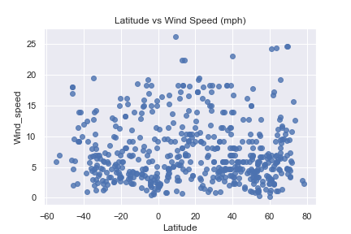

# JSON_WeatherPy

## Analysis

* As expected, there was a clear correlation between the closeness of the Equator and the measured Temperature. However, the Temperature showed its peak not precisely at over the Equator, but 20 degrees north of it. 

* Humidity showed little correlation with latitude, with a marked exception of the Equator and its proximities. Latitude cero exhibited the highest humidity concentration of all the distribution. 

* Cloudiness and Wind Speed showed no clear relationship with Latitude.

## Background 

Python script to visualize the weather of 500+ cities across the world of varying distance from the equator using [CityPy](https://pypi.python.org/pypi/citipy), a simple Python library, and the [OpenWeatherMap](https://openweathermap.org/api) API. 

The visualizations includce a series of scatter plots to showcase the following relationships:

    Temperature (F) vs. Latitude
    Humidity (%) vs. Latitude
    Cloudiness (%) vs. Latitude
    Wind Speed (mph) vs. Latitude

The script accomplishes the following: 

* Randomly selects at least 500 unique (non-repeat) cities based on latitude and longitude.

* Performs a weather check on each of the cities using a series of successive API calls.

* Includes a print log of each city as it's being processed with the city number and city name.

* Saves both a CSV of all data retrieved and png images for each scatter plot.


```python
# Dependencies and Setup
import seaborn as sns
import pandas as pd
import numpy as np
import requests
import time

# Import API key
from api_keys import api_key

# Incorporated citipy to determine city based on latitude and longitude
from citipy import citipy

# Range of latitudes and longitudes
lat_range = (-90, 90)
lng_range = (-180, 180)
```
## Generate Cities List


```python
# List for holding lat_lngs and cities
lat_lngs = []
cities = []

# Create a set of random lat and lng combinations
lats = np.random.uniform(low=-90.000, high=90.000, size=1500)
lngs = np.random.uniform(low=-180.000, high=180.000, size=1500)
lat_lngs = zip(lats, lngs)

# Identify nearest city for each lat, lng combination
for lat_lng in lat_lngs:
    city = citipy.nearest_city(lat_lng[0], lat_lng[1]).city_name
    
    # If the city is unique, then add it to a our cities list
    if city not in cities:
        cities.append(city)

# Print the city count to confirm sufficient count
len(cities)
```
615

## Perform API Calls

```python
# Perform API Calls
url = "http://api.openweathermap.org/data/2.5/weather?units=Imperial&APPID=" + api_key 

temperature_list = []
humidity_list = []
cloudiness_list = []
wind_speed_list = []
latitude_list = []
counter = 1

for city in cities:
    try:
        query_url = f"{url}&q={city}"
        weather_response = requests.get(query_url).json()
        
        counter += 1
        print(f"Processing Record {counter} | {city}")
        print(f"{url}&q={city}")

        temperature = weather_response["main"]["temp"]
        temperature_list.append(temperature)
    
        humidity = weather_response["main"]["humidity"]
        humidity_list.append(humidity)
    
        cloudiness = weather_response["clouds"]["all"]
        cloudiness_list.append(cloudiness)
    
        wind_speed = weather_response["wind"]["speed"]
        wind_speed_list.append(wind_speed)
    
        latitude = weather_response["coord"]["lat"]
        latitude_list.append(latitude)
        
    except:
        print("City not found. Skipping...")
    
print("Data Retrieval Complete")
```

Data Retrieval Complete

```python
# Convert Raw Data to DataFrame

weather_data = {"Temperature": temperature_list,
              "Humidity":humidity_list,
              "Cloudiness":cloudiness_list,
              "Wind_speed":wind_speed_list,
              "Latitude": latitude_list,}

weather_df = pd.DataFrame(weather_data)

weather_df.count()
```

    Temperature    550
    Humidity       550
    Cloudiness     550
    Wind_speed     550
    Latitude       550


* Export the city data into a .csv.
* Display the DataFrame.

```python
# Save data frame to CSV
weather_df.to_csv("weather_data.csv")

weather_df.head()
```

<table border=\"1\" class=\"dataframe\">
  <thead>
   <tr style=\"text-align: right;\">
       <th></th>
       <th>Temperature</th>
       <th>Humidity</th>
       <th>Cloudiness</th>
       <th>Wind_speed</th>
       <th>Latitude</th>
    </tr>
  </thead>
  <tbody>
   <tr>
       <th>0</th>
       <td>53.60</td>
       <td>87</td>
       <td>75</td>
       <td>4.47</td>
       <td>53.05</td>
    </tr>
    <tr>
       <th>1</th>
       <td>84.20</td>
       <td>83</td>
       <td>75</td>
       <td>5.82</td>
       <td>17.01</td>
       </tr>
       <tr>
       <th>2</th>
       <td>49.32</td>
       <td>82</td>
       <td>98</td>
       <td>5.17</td>
       <td>62.11</td>
       </tr>
       <tr>
       <th>3</th>
       <td>46.40</td>
             <td>87</td>
             <td>0</td>
             <td>2.24</td>
             <td>62.23</td>
           </tr>
           <tr>
            <th>4</th>
            <td>47.79</td>
             <td>86</td>
            <td>100</td>
             <td>5.41</td>
             <td>53.51</td>
       </tr>
       </tbody>
       </table>
       </div>
       

## Plotting the Data

* Use proper labeling of the plot titles (including date of analysis) and axes labels.
* Save the plotted figures as .pngs.

```python
# Latitude vs Temperature Plot
sns.set()
lat_temp_plot = sns.regplot(x=weather_df["Latitude"], y=weather_df["Temperature"], data=weather_df, fit_reg=False).set_title("Latitude vs Temperature (F)")
figure = lat_temp_plot.get_figure()    
figure.savefig("lat_temp_plot.png")
```


```python
# Latitude vs Humidity Plot
sns.set()
lat_hum_plot = sns.regplot(x=weather_df["Latitude"], y=weather_df["Humidity"], data=weather_df, fit_reg=False).set_title("Latitude vs Humidity (%)")
figure = lat_hum_plot.get_figure()    
figure.savefig("lat_hum_plot.png")
```


```python
# Latitude vs Cloudiness Plot
sns.set()
lat_clo_plot = sns.regplot(x=weather_df["Latitude"], y=weather_df["Cloudiness"], data=weather_df, fit_reg=False).set_title("Latitude vs Cloudiness (%)")
figure = lat_clo_plot.get_figure()    
figure.savefig("lat_clo_plot.png")
```


```python
# Latitude vs Wind Speed Plot
sns.set()
lat_ws_plot = sns.regplot(x=weather_df["Latitude"], y=weather_df["Wind_speed"], data=weather_df, fit_reg=False).set_title("Latitude vs Wind Speed (mph)")
figure = lat_ws_plot.get_figure()    
figure.savefig("lat_ws_plot.png")
```

